# Tabla de Contenidos

<!-- TOC -->

- [1. AWS](#aws)
    - [1.1. Crea una cuenta](#crea-una-cuenta)
    - [1.2. Crear la instancia](#crear-la-instancia)
    - [1.3. IP elástica](#ip-el%C3%A1stica)
    - [1.4. PuTTY](#putty)
    - [1.5. SSH](#ssh)
    - [1.6. Instalar Apache](#instalar-apache)
    - [1.7. Instalar MySQL](#instalar-mysql)
        - [Resumen Comandos Básicos Iniciales de MySQL:](#resumen-comandos-b%C3%A1sicos-iniciales-de-mysql)
    - [1.8. Otras instalaciones extras](#otras-instalaciones-extras)
    - [1.9. systemctl stop/disable firewall-cmd](#systemctl-stopdisable-firewall-cmd)
- [2. Ionos](#ionos)
    - [2.1. Dominio](#dominio)
    - [2.2. Registro DNS](#registro-dns)
    - [2.3. Subdominio](#subdominio)
- [3. Instalar y configurar Wordpress](#instalar-y-configurar-wordpress)
- [4. Apache](#apache)
    - [4.1. Archivo vhost](#archivo-vhost)
    - [4.2. Filezilla](#filezilla)
    - [4.3. Reseteo y despliegue](#reseteo-y-despliegue)
- [5. Posibles errores](#posibles-errores)
    - [5.1. Error httpd](#error-httpd)
    - [5.2. Error wordpress css](#error-wordpress-css)
    - [5.3. El super error de wordpress](#el-super-error-de-wordpress)

<!-- /TOC -->

# 1. AWS

Vamos a a la web de AWS (Amazon Web Services): https://aws.amazon.com/es/

## 1.1. Crea una cuenta

Necesitas crearte una cuenta de AWS, para la cual, si no recuerdo mal, tendrás que introducir un método de pago (tarjeta de débito, por ejemplo) y pagar una cantidad simbólica para validar tu cuenta (yo pagué 1€).

Es posible que desde que yo lo hice, ahora haya cambiado algo de esto, pero de seguro que al menos uno de los requesitos es introducir un método de pago válido.

## 1.2. Crear la instancia

AWS tiene muchísimas funciones y por ende, muchos apartados y secciones, pero nosotros nos moveremos principalmente en la sección de EC2.

En EC2 encontrarás todo lo relacionado a tus instancias. Por instancia nos referimos a una máquina virtual.

Necesitamos crear una instancia de Amazon Linux 2, la cual es gratuita (dentro de ciertos límites de uso, como las horas activas...)

Para más información sobre todo lo que ofrece la capa gratuita de aws:

https://aws.amazon.com/es/free/?all-free-tier.sort-by=item.additionalFields.SortRank&all-free-tier.sort-order=asc&awsf.Free%20Tier%20Types=*all&awsf.Free%20Tier%20Categories=categories%23compute

Preguntas frecuentes sobre la capa gratuita: https://aws.amazon.com/es/free/faqs/

Para crear la instancia de Amazon Linux 2 seguiremos los pasos de este video:
https://www.youtube.com/watch?v=A4f-EMAuynU&ab_channel=andresibarra

**Nota**: Guárdate bien en algún lugar de tu ordenador (o en Google Drive si tienes bien protegida tu cuenta de Google) la private key (la clave privada RSA que descargas... el archivo de seguridad de conexión).

## 1.3. IP elástica

Debemos asociar nuestra instancia a una IP elástica. Pero, ¿qué es una IP elástica? Vamos a echar un vistazo a la propia documentación oficial de AWS: https://docs.aws.amazon.com/es_es/AWSEC2/latest/UserGuide/elastic-ip-addresses-eip.html

Para asociar una IP elástica a una instancia: https://www.youtube.com/watch?v=jzCyxgydM8E

## 1.4. PuTTY

PuTTY es un cliente SSH, Telnet, rlogin, y TCP raw con licencia libre. Para descargar el instalador de Putty: https://www.putty.org/

Sobre como convertir la clave privade (RSA) .pem en .ppk, puedes volver a consultar el video de antes de cómo crear la instancia (al final de este video se hacían los pasos para conectarse por Putty y con ssh). No onstante, te vuelvo a dejar otro video por aquí donde se vuelven a repetir los pasos necesarios: https://www.youtube.com/watch?v=Xd5hqUvwCN4&t=296s&ab_channel=JulianDavidAlfonsoMoreno&t=4m56s

Putty permite muchísimas opciones de configuración y personalización. Por ejemplo, tanto para cambiar los colores de la terminar del Putty, como para guardar un inicio de sesión, recomiendo ver el siguiente video: https://www.youtube.com/watch?v=eq4vH6FuGS0&ab_channel=EstebanCosano

**Nota**: Lo primero que debemos hacer al entrar en el servidor por primera vez (y alguna otra vez cada par de meses por lo menos) es ejecutar el comando `yum update` para actualizar todos los programas y demás elementos posibles del servidor.

## 1.5. SSH

Siempre que vamos a entrar en el servidor (e igualmente si otra persona ajena intentase entrar) se hace uso de la seguridad de conexión mediante SSH.

El SSH es un protocolo de administración remota que le permite a los usuarios controlar y modificar sus servidores remotos a través de Internet a través de un mecanismo de autenticación.

El archivo que alberga las opciones de configuración del SSH lo podemos encontrar en /etc/ssh/sshd_conf 

Realmente no tendríamos que tocar nada de este archivo, a no ser que se quisiera una configuración más específica que defina el método de login y tal... 

**Nota**: Es mejor mantener el "PasswordAuthentication no" porque realmente es emjor la entrada por la clave privada RSA que descagamos al crear la instancia... y de ahí el otro parámetro de la configuración que se llama "AuthorizedKeysFile"...

**Nota**: en esta configuración también podemos cambiar el puerto de entrada predeterminado (22) a otro personalizado, y en el grupo de seguridad de AWS cambiar el puerto 22 del ssh al nuevo que hayamos definido en el archivo de configuración.

**Nota**: Si manipulando este archivo, y quizás a causa de la inexperiencia o cualquier error, se produjera un "lost in space", lo primero es mantener la calma. AWS cuenta con una consola de recuperación (cloud shell) para nuestras instancias: https://www.youtube.com/watch?v=BfWfNLGNEe8

**Nota**: si estuvieras interesado en una copia de seguridad de tu instancia ec2 (genera cargos extra en tu método de pago), echa un vistazo a esta documentación de AWS sobre los backups: https://aws.amazon.com/es/backup/?whats-new-cards.sort-by=item.additionalFields.postDateTime&whats-new-cards.sort-order=desc

## 1.6. Instalar Apache

Para instalar Apache, bastará con ejecutar el comando `yum install httpd -y`

Video Ejemplo: https://www.youtube.com/watch?v=ulIrn6O8v_g&ab_channel=TechnoConfig

**Nota**: Si de primeras, no conseguimos ver la página de prueba del test de Apache en nuestro navegador, recordar consultar el grupo de seguridad de AWS para comprobar el respectivo puerto de Apache...

## 1.7. Instalar MySQL

Para instalar MySQL: `yum install mysql`

Para el resto de configuraciones iniciales de MySQL seguir los pasos del siguiente video: https://www.youtube.com/watch?v=N9DwaThhpsg&ab_channel=SamMeech-Ward

### Resumen Comandos Básicos Iniciales de MySQL:

- `mysql -u root -p`
- `SHOW DATABASES;`
- `DROP DATABASE testdb;`
- `SELECT User, Host FROM mysql.user;`
- `DROP USER 'wp'@'localhost';`
- `SELECT CURRENT_USER();`
- `SHOW GRANTS;`
- `SHOW GRANTS FOR 'Usuario';`
- `select user,host,insert_priv,update_priv,delete_priv from mysql.db where db='SYSADMIT-DB';`
- `CREATE USER 'wordpress-user'@'localhost' IDENTIFIED WITH mysql_native_password BY 'yourPassword';`
- `CREATE DATABASE wordpress-db;`
- `GRANT ALL PRIVILEGES ON wordpress-db.* TO "wordpress-user"@"localhost";`
- `FLUSH PRIVILEGES;`

## 1.8. Otras instalaciones extras

Para instalar Net Tools: `yum install net-tools`

Para instalar Telnet: 

- `yum install -y telnet`
- `yum install -y telnet-server`
- `systemctl start telnet.socket`
- `systemctl enable telnet.socket`
- `sudo yum install policycoreutils-python`

**Nota**: Para instalar PHP, esperar a entrar en la guía del 1º objetivo (Nginx y PHP)

## 1.9. systemctl stop/disable firewall-cmd

Es muy importante que detengamos y dehabilitemos el firewall interno de la instancia, ya que todo lo relacionado con los puertos, será manejado a través del grupo de seguridad de la instancia en AWS.

# 2. Ionos

Crea una nueva cuenta (regístrate) en Ionos (el antiguo One-and-One).

## 2.1. Dominio

Ahora tienes que comprar un dominio (tudominio.com) por 1 euro, y te regalan con la compra del dominio el SSL también.

**Nota**: el dominio lo compramos por 1 euro, pero es el precio sólo del primer año, a partir del segundo año se eleva a 10 euros, equiparándose así al resto de plataformas proveedoras de dominios)

**Nota**: más adelante estudiaremos el concepto de SSL y veremos qué hacer con ello.

## 2.2. Registro DNS

Ahora tienes que asociar la IP de tu instancia amazon linux, con el dominio que acabas de comprar.

Para ello, puedes hacerlo desde el botón de "engranaje" de las opciones de tu dominio, y pulsando sobre "ajustar destino" --> "registro dns" --> "añadir registro" --> "tipo A"

Cuando nos salga el casillero para escribir el nombre del dominio, pondremos el caracter @ (porque el caracter @ significa "a este mismo", que en este caso nos referimos a "este mismo dominio"), y en el otro casillero para decirle a dónde debe apuntar, pondremos la ip de nuestra instancia (la ip pública, claro)

**Nota**: recuerda que siempre puedes consultar los datos y demás información sobre tu instancia en AWS en la sección de EC2 --> Instancias

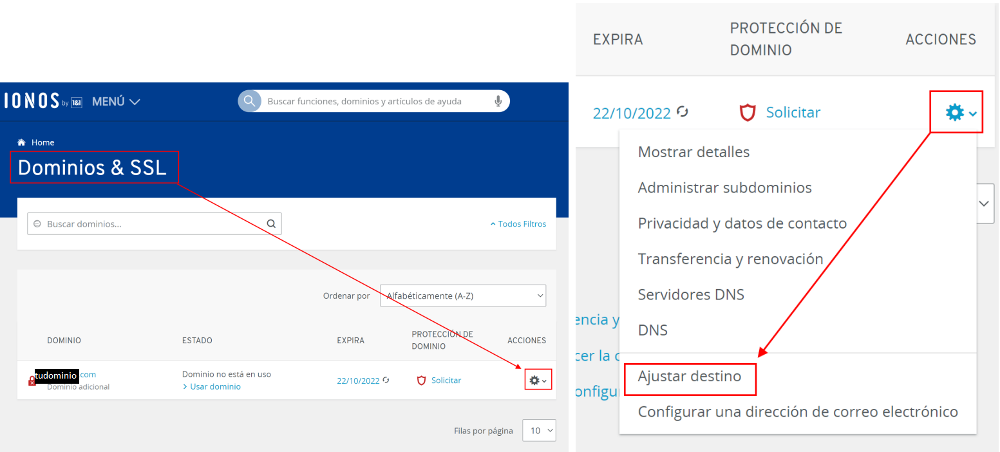

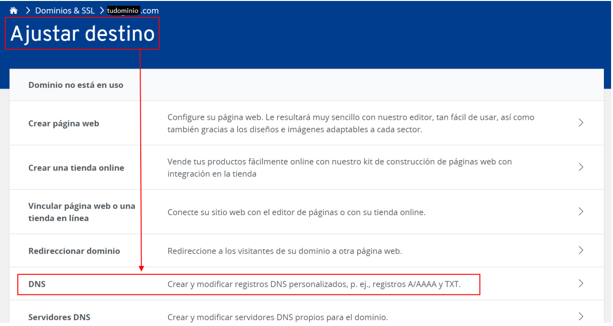

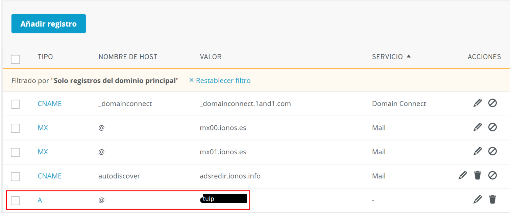

**Nota**: vuelvo a recordar que las censuras de las imágenes corresponden a mi dominio y a mi ip.

Si ahora vamos a nuestro servidor y ejecutamos el clásico comando de `nslookup tudominio.com`, podremos comprobar que nuestro dominio ya está enlazado a nuestra instancia (ip) correctamente.

**Nota**: cuando estamos en la pantalla de creación del registro dns tipo A para asociar nuestro dominio principal a la ip de nuestra instancia, como nombre del host, no hay que escribir otra vez el nombre de nuestro dominio, si no que ponemos el caracter "@", que significa "este mismo dominio".

**Nota**: quisiera recordar, que al principio me confundí en esta parte, y cuando creé por primera vez el registro dns de mi dominio, lo puse con la tripe w, es decir, www.tudominio.com, y esto no debe ser así, es decir, tienes que poner directamente tu dominio, sin las w (tudominio.com). He visto conveniente recordarte este detalle confuso que tuve para que tú no caigas en lo mismo, y también porque quizás en algunas imagenes de los primeros objetivos (nginx, tomcat y apacheSSL) aparecerá mi dominio con la triple w, pero ya en el objetivo del nginxSSL, cambié bien el servername a mi dominio sólo, sin la triple w... De hecho, cuando tenía el www. delante de mi dominio, Ionos me decía que aún no estaba usando realmente mi dominio.

## 2.3. Subdominio

Para crear subdominios en Ionos, se puede hacer directamente a través del siguiente enlace: https://www.ionos.es/ayuda/dominios/estructurar-la-pagina-web-con-subdominios/crear-un-subdominio/

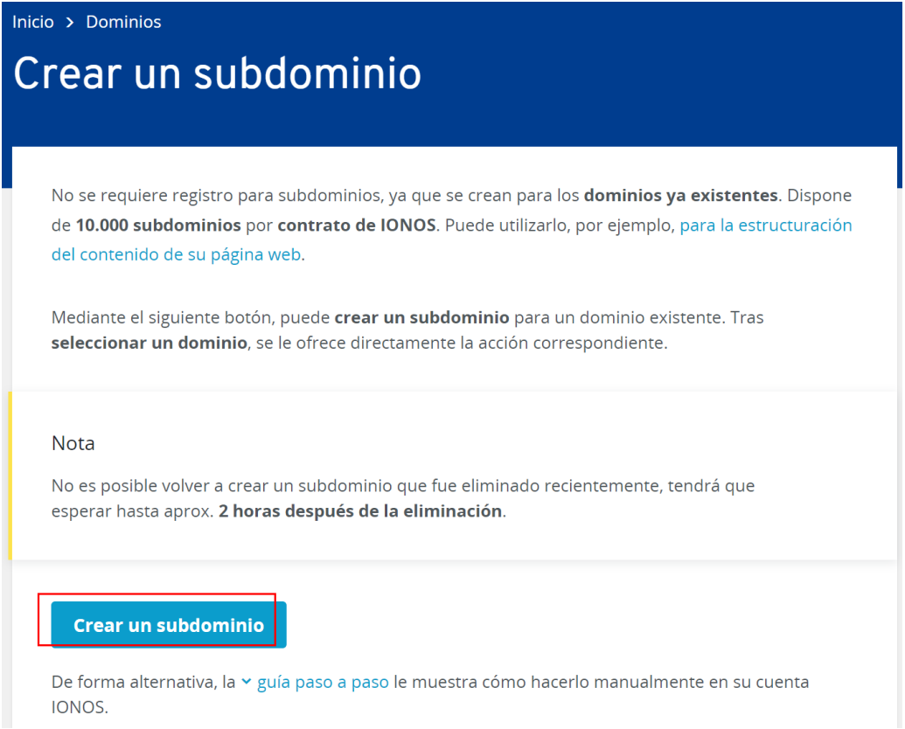

O bien a través del siguiente camino:

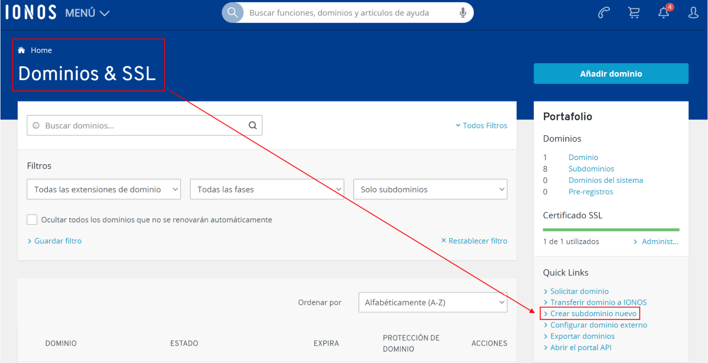

**Nota**: en Ionos, si en el home de la sección de dominios, en el botón del "engranaje", pulsamos en "administrar dominios", también llegaremos a un panel donde se recogen todos lo ssubdominios y con las demás opciones de crear uno nuevo, etc.

Con ambos ambas opciones, llegaremos al mismo sitio, donde tendremos que poner el nombre del subdominio, y añadirle el registro dns de tipo A para indicarle la ip hacia donde apunta.

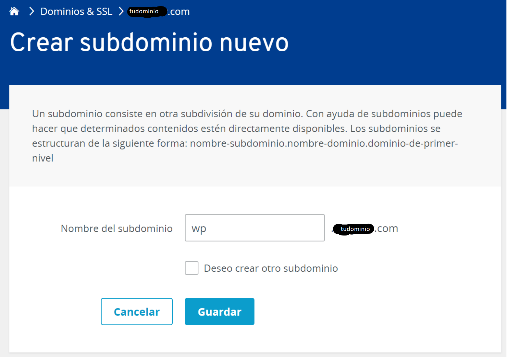

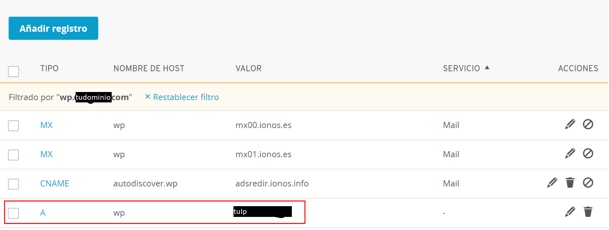

**Nota**: cuando creamos un nuevo subdominio, se crea automáticamente un registro dns tipo A, el cual debemos modificar, o bien eliminarlo y crearlo bien de nuevo nosotros mismos (si intentas añadir nuevos registros dns tipo A sin
eliminar los defaults que ya se habían generado solos, te saltará un aviso tipo warning y de confirmación).

Llegados a este punto y recapitulando, ya tenemos un dominio listo y asociado a nuestra instancia, el cual lo utilizaremos para desplegar nuestro portfolio; y por otro lado, también tenemos un subdominio listo para desplegar nuestro wordpress.

# 3. Instalar y configurar Wordpress

Para instalar y configurar Wordpress, seguir la siguiente guía provista directamente por la documentación oficial de Amazon:

https://docs.aws.amazon.com/es_es/AWSEC2/latest/UserGuide/hosting-wordpress.html

**Nota**: cuando descargamos el comprimido del wordpress en el primer paso, recuerda que para desplegarlo posteriormente en Apache, debemos descomprimir este archivo (y colocar los archivos resultantes) en `/var/www/html/wordpress/`.

**Nota**: en ciertas ocasiones, algunos usuarios cuentan que, cuando llegaban a la parte de poner en chrome la IP/wordpress para empezar su configuración, les daba un mensaje de incompatibilidad de versiones que decía: "Your PHP installation appears to be missing the MySQL extension which is required by WordPress"

Este error se resuelve con tan sólo instalar MySQLi: `yum install php-mysqli`, y ahora ya sí que aparece el menú en chrome (IP/wordpress) para empezar a configurarlo.

**Nota**: Recuerda que la instalación final, puede llevarse a cabo tanto desde dentro del servidor en los archivos de configuración de wordpress (tal como explica la guía oficial de AWS), o en el navegador a través de nuestro dominio asociado, http://tudominio.com/wordpress/wp-admin/setup-config.php

**Nota**: (opcionalmente) Para instalar el WP-CLI: https://wp-cli.org/es/

# 4. Apache

Para empezar por fin el contenido y la verdadera materia de esta asignatura, lo suyo es que partamos desde el punto más cercano y similar posible a cuando terminamos Sistemas Informáticos en el primer año del grado.

Y es que desplegar el portfolio en Apache, fue un objetivo del año pasado, el cual ya debemos tener más que controlado y practicado.

## 4.1. Archivo vhost

Ahora en el servidor, vamos a /etc/httpd/conf.d/ y creamos el clásico archivo llamado vhosts.conf

```
<VirtualHost *:80>

    # The name your website should respond to
    ServerName tudominio.com
    ServerAlias tudominio.com
    #ServerAdmin  @nosequien.com

    # Tell Apache where your document root is
    DocumentRoot /var/www/html/portfolio

    # Add this line if you are allowing .htaccess overrides
    <Directory /var/www/html/portfolio>
        AllowOverride All
    </Directory>

</VirtualHost>

<VirtualHost *:80>

    # The name your website should respond to
    ServerName wp.tudominio.com
    ServerAlias wp.tudominio.com
    #ServerAdmin  @nosequien.com

    # Tell Apache where your document root is
    DocumentRoot /var/www/html/wordpress

    # Add this line if you are allowing .htaccess overrides
    <Directory /var/www/html/wordpress>
        AllowOverride All
    </Directory>

</VirtualHost>
```

## 4.2. Filezilla

Ya tan sólo queda subir al servidor los archivos correspondientes al portfolio y al wordpress. Para ello usaremos filezilla.

Para subir archivos al servidor con Filezilla y para conectar éste al servidor de forma segura: https://www.youtube.com/watch?v=_6Tc-8n2w2Y

Para el portfolio, creamos su respectiva carpeta, y al subir los archivos, los colocaremos en `/var/www/html/portfolio/`.

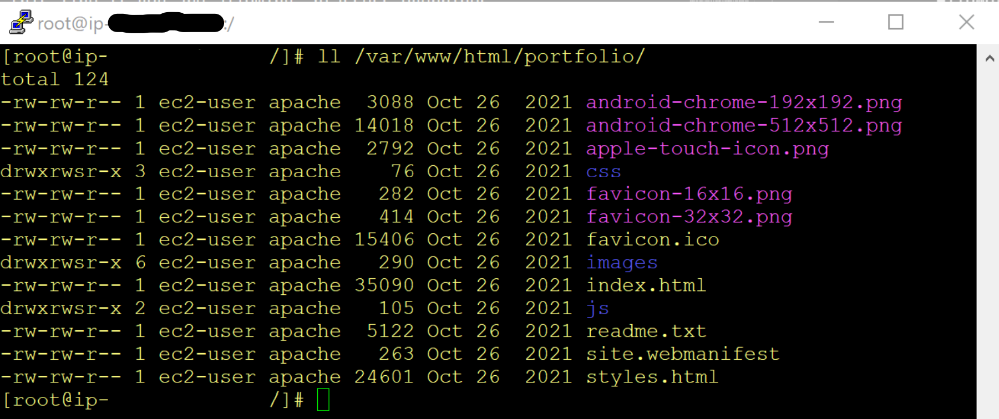

Para el wordpress, debimos de descomprimir sus archivos con anterioridad (y colocarlos) en el directorio `/var/www/html/wordpress/`.

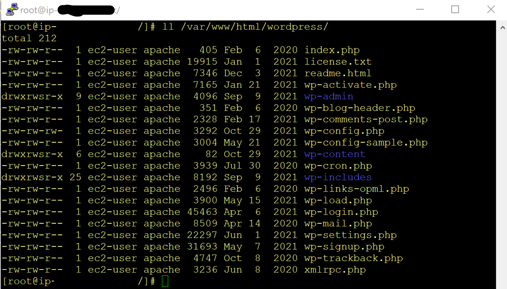

Curiosidad: sobre los permisos de mis directorios en `/var/www/html/x/`. Cuando fui a ver los permisos de mi carpeta /wordpress/ o la del /portfolio/, me di cuenta de que para la ejecución de grupos había una "s" en vez de una "x ... El permiso SUID o setuid se asigna sumándole 4000 a la representación octal de los permisos de un archivo y otorgándole además, permiso de ejecución al propietario del mismo. Al hacer esto, en lugar de la «x» en la primera terna de los permisos, aparecerá una «s», o una «S» si no hemos otorgado el permiso de ejecución correspondiente, en este caso, el permiso no tiene efecto. Cuando el permiso SUID está activado en un fichero, el usuario que ejecute el fichero tendrá durante la ejecución los mismos privilegios que el propietario del fichero. Por ejemplo, si el administrador (root) crea un fichero y le activa el permiso SUID, todo usuario que lo ejecute dispondrá de privilegios de administrador hasta que el programa finalice.

## 4.3. Reseteo y despliegue

Reseteamos Apache con el comando `systemctl restart httpd`, y si ahora vamos a nuestro navegador, y abriendo dos pestañas, ponemos en cada URL, tudominio.com y wp.tudominio.com, respectivamente, comprobaremos que todo funciona perfectamente.

# 5. Posibles errores

## 5.1. Error httpd

Tras hacer todos los pasos de esta guía y visitar en Chrome la siguiente vez el subdominio de wordpress... es posible que apache de un fallo y no pueda hacer nada (como si se hubiera “roto”).

En mi caso, leyendo la información que proporcionaba `systemctl status httpd`, el error estaba en que apache no podía leer una línea que se encontraba dentro de un archivo que wordpress había creado automáticamente en `/etc/httpd/conf.d/wordpress.conf`. Cuando eliminé este archivo, ya si funcionaba el apache (`sudo systemctl restart httpd`).

## 5.2. Error wordpress css

Es posible que tras instalar y configurar wordpress, a los días siguientes cuando lo vulevas a visitar en el navegador, de pronto veas que aparece sin estilos (sin css) y pareciendo que se ha “roto”.

Esto ocurre porque previamente habíamos ejecutado la instalación de wordpress a través de la IP... es decir, lo hicimos a través de “tuIp/wordpress/wp-admin/wp-config.php”.

Y es que resulta, que para instalar bien wordpress, hay que instalarlo desde el subdominio... es decir, a través de: “wp.tudominio.com/wordpress/wp-admin/wp-config.php”... y con ello ya se instalará bien, y no volveremos a perder los estilos.

Conclusión: para instalar bien wordpress debemos, primero crear el subdominio, y luego instalarlo en él a través del navegador.

**Nota**: antes de ejecutar la instalación a través del navegador, dejar previamente creado y configurado el archivo vhosts, y que el Directory de
wordpress apunte y asocie el subdominio (creado previamente con Ionos)
con wordpress.

## 5.3. El super error de wordpress

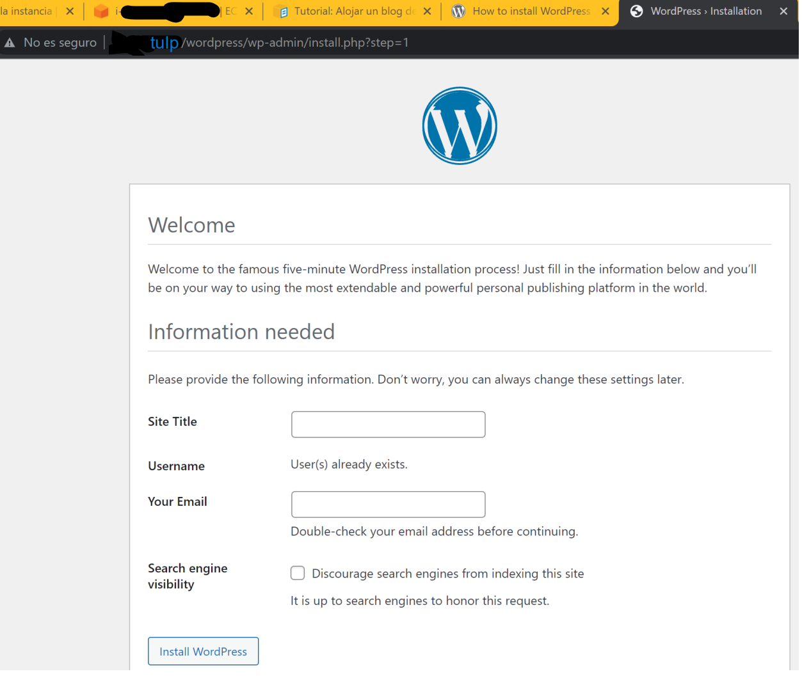

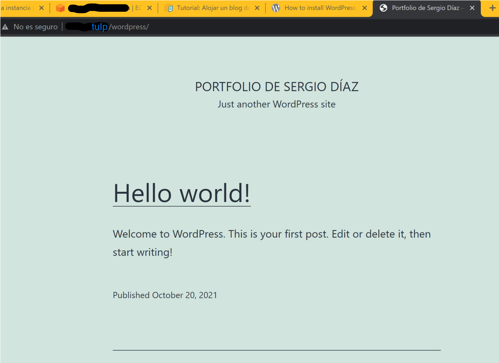

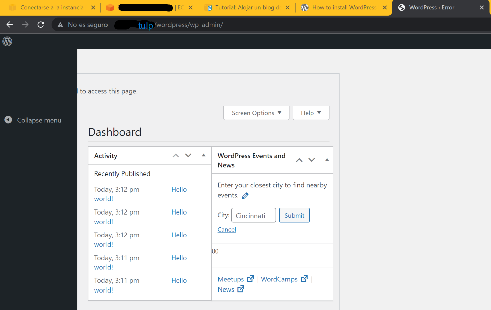

La causa de este error fue una extraña mezcla entre diferentes versiones de PHP que tenía instaladas (1), y que tenía habilitado el repositorio Remi-80-PHP(2)

1. NO hay que instalar los paquetes de php80-x
2. hay que instalar el repositorio de amzn2extras
3. meterse dentro del archivo de este repositorio y poner en todo (menos en la parte de epel) enable=1
4. Ahora instalar todos los paquetes de php normales... `sudo yum install php*`... y habiendo hecho lo de antes, se supone que se activarán en sus versiones 8 y apuntando hacia el repositorio de amzn2extras
5. Por lo demás, instalar normal el wordpress, haciendo previamente lo del usuario y su base de datos, etc... y wordpress se instala bien y funciona perfectamente.
