# 1. Instalar y Configurar Nginx

## 1.1. Instalar Nginx y PHP

Instalación Nginx: Install Nginx on AWS EC2 Amazon Linux 2

https://devcoops.com/install-nginx-on-aws-ec2-amazon-linux/

Instalación PHP 1: Install PHP 8.0 on Amazon Linux 2

https://techviewleo.com/install-php-8-on-amazon-linux/

Instalación PHP 2: Setup PHP-FPM (PHP 8) Nginx in Amazon Linux 2

https://awswithatiq.com/setup-php-nginx-in-amazon-linux-2/

Video Extra 1: Install NGINX + PHP 8 on Amazon Linux 2

https://www.youtube.com/watch?v=W3s4tOtlReU

Video Extra 2: Setup WordPress with Nginx and PHP-FPM

https://www.youtube.com/watch?v=3jQnrBLE-SY

Y una vez que ya hemos instalado Nginx y PHP...

## 1.1. Vamos al archivo php.ini

`sudo vi /etc/php.ini`

## 1.2. Buscamos la línea en la que pone

`;cgi.fix_pathinfo=1`

## 1.3. La descomentamos y la igualamos a 0

`cgi.fix_pathinfo=0`

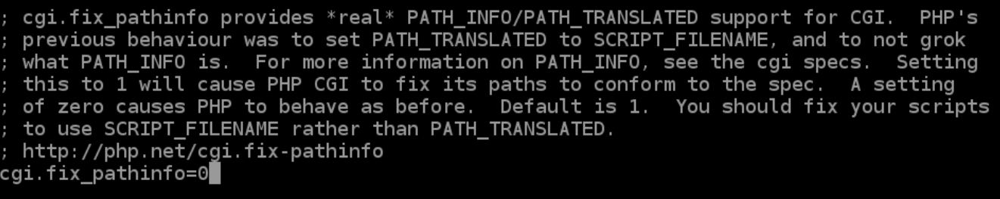

# 2. Configurar php-fpm

Vamos al archivo /etc/php-fpm.d/www.conf

## 2.1. Modificamos Listen... ponemos 

`listen = /var/run/php-fpm/php-fpm.sock`

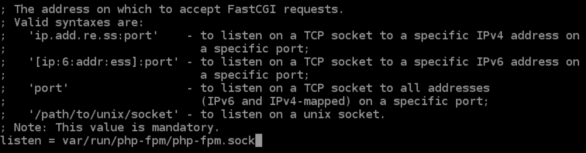

Más adelante le daremos la ruta del socket a Nginx.

Una vez hecho esto, no necesitamos que php-fpm escuche por localhost (127.0.0.1).

## 2.2. Usuario con el que se ejecuta php-fpm

Decimos a php-fpm con qué usuario ha de ejecutarse su proceso.

Dado que php-fpm necesitará entrar en los directorios web de Nginx, el ajuste es el siguiente:

```
user = nginx
group = nginx
```

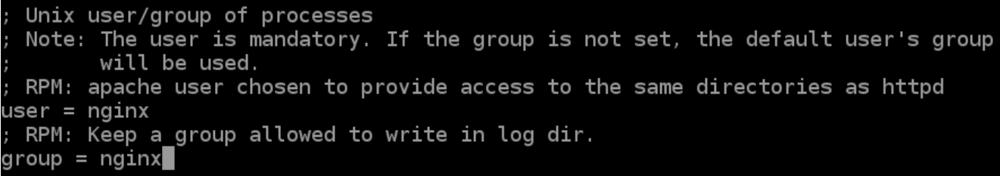

## 2.3. Lista de usuarios a los que php-fpm escuchará

Un usuario o proceso que no esté en esta lista llamada acl_users será
ignorado y no se le atenderá.

Por eso mismo, descomentamos la siguiente línea, y nos aseguramos que en la lista de usuarios esté el usuario que use Nginx:

`listen.acl_users = apache,nginx`

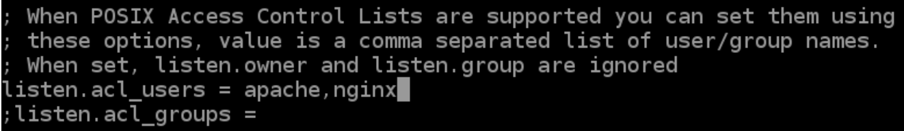

Nota: Esto da permisos a los procesos nginx para conectar con el socket de php-fpm.

Ojo porque un espacio después de la coma puede hacer que falle.

## 2.4. Configurar el servicio php-fpm

`systemctl start php-fpm`
`systemctl enable php-fpm`

Curiosidad: La primera vez que hice esta parte, antes de hacer en este punto un systemctl restart php-fpm, me doy cuenta de que tengo que ir al archivo de /etc/php-fpm.d/www.conf y en él cambiar la línea de listen = /run/php-fpm/www.conf a listen = /var/run/php-fpm/php-fpm.sock

La cosa fue que, al hacer este par de cosas en ese orden, es decir, primero cambié aquella ruta del archivo para que cogiese un archivo que aún no existe ... y cuando después le hice el systemctl start/enable/restart, me daba un error de que no se podía activar ni hacer nada con el servicio php-fpm, y en el error que me daba al hacer systemctl status -l php-fpm, el error venía precisamente de la ruta que apunta a ese archivo de php-fpm.sock el cual aún
no existe...

La curiosidad de esto está en que, haciendo los pasos justamente al revés, es decir, si hiciese un yum remove php-fpm y después un yum install php-fpm, y reiniciase el archivo de www.conf para volver hacer estos pasos al revés, puedo comprobar que, si primero le hago el systemctl start/enable/restart al php-fpm, y después modifico la ruta esa del archivo que apunta al socket que aún no existe, me ocurre que ahora sí funciona el servicio de php-fpm, y simplemente he hecho los mismos pasos pero en diferente orden, y ya no me da aquel error, y es que se trata de un archivo que se genera automáticamente.

# 3. Configuración del server block

Configuramos el server block para que incluya la conexión con php-fpm

## 3.1. Vamos a crear un archivo en la ruta /etc/nginx/conf.d/

`sudo vi /etc/nginx/conf.d/tudominio.com.conf`

## 3.2. Dentro de él, vamos a poner lo siguiente:

```
server {
  listen 80;
  server_name tudominio.com;
  root /usr/share/nginx/html;
  index index.php index.html index.htm;
  charset UTF-8;
  location / {
    try_files $uri $uri/ =404;
  }
  error_page 404 /404.html;
  error_page 500 502 503 504 /50x.html;
  location = /50x.html {
    root /usr/share/nginx/html;
  }
  location ~ \.php$ {
    try_files $uri =404;
    fastcgi_pass unix:/var/run/php-fpm/php-fpm.sock;
    fastcgi_index index.php;
    fastcgi_param SCRIPT_FILENAME
    $document_root$fastcgi_script_name;
    include fastcgi_params;
  }
  include fastcgi_params;
  fastcgi_param  SCRIPT_FILENAME
  $document_root$fastcgi_script_name;
  fastcgi_split_path_info ^(.+\.php)(/.+)$;
  fastcgi_index index.php;
  # fastcgi_intercept_errors on;
  # fastcgi_keep_conn on;
  # fastcgi_read_timeout 300;
  # fastcgi_pass   127.0.0.1:9000;
  #fastcgi_pass  unix:/var/run/php-fpm/www.conf;
  #for ubuntu unix:/var/run/php/php8.0-fpm.sock;
  ##
  # FastCGI cache config
  ##
  # fastcgi_cache_path /var/cache/nginx levels=1:2
  keys_zone=WORDPRESS:10m max_size=1000m inactive=60m;
  # fastcgi_cache_key $scheme$host$request_uri$request_method;
  # fastcgi_cache_use_stale updating error timeout invalid_header http_500;
  fastcgi_cache_valid any 30m;
}
```

Guardamos y salimos del archivo, para hacer un sudo systemctl restart nginx

## 3.3. Ahora vamos a la ruta que hemos definido como Document Root de Nginx

Vamos a /usr/share/nginx/html/

Aquí vamos a crear un archivo llamado index.php (porque en el server block que habíamos creado antes hemos dicho que a través del Document Root de Nginx, sólo se pueda acceder a los archivos llamados index index.php index.html index.htm

`sudo vi /usr/share/nginx/html/index.php`

## 3.4. Dentro de este index.php definiremos la clásica función que nos informa acerca de todas las características de nuestro php

```
<?php
  phpinfo();
?>
```

## 3.5. De nuevo hacemos un

`sudo systemctl restart nginx`

`sudo systemctl restart php-fpm`

Abrimos una nueva pestaña en nuestro navegador, y ponemos nuestra IP, o mejor aún, nuestro dominio (www.tudominio.com), y añadimos /index.php

Y efectivamente nos sale la lectura de la función infophp() mostrándonos toda la información acerca de nuestro php, lo cual quiere decir que nuestro php funciona perfectamente.

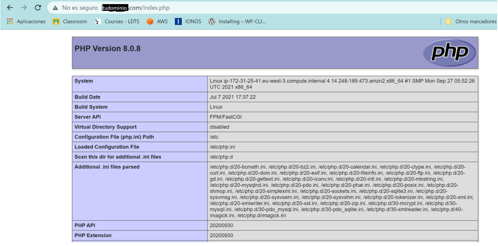

Para el server block, he seguido esta guía:

https://awswithatiq.com/setup-php-nginx-in-amazon-linux-2/

# 4. Despliegue en Nginx

> VirtualHosts, Server blocks y Hosts. Cómo dar servicio web de varios dominios diferentes con un servidor y una sola IP

Esta parte trata de volver a conseguir sacar por el navegador, el portfolio a través de mi dominio principal, y el wordpress a través de un subdominio

Nota: Antes de nada, recordar que,

- los server blocks están en: /etc/nginx/conf.d/
- el DirectoryRoot de Nginx está en: /usr/share/nginx/html/

## 4.1. Vamos primero a por el portfolio

Copiamos la carpeta del portfolio que ya hicimos desde el DirectoryRoot de Apache hacia el DirectoryRoot de Nginx:

`sudo cp -rf /var/www/html/portfolio /usr/share/nginx/html/`

## 4.2. Cambiamos los permisos del grupo 

Tanto para el directorio de /usr/share/nginx/html/ como para el directorio del /usr/share/nginx/html/portfolio

`sudo chgrp -R nginx /usr/share/nginx/html/`

`sudo chgrp -R nginx /usr/share/nginx/html/portfolio/`

## 4.3. Server block

Ahora entramos en el server block que ya configuramos para el PHP de Nginx

`sudo vi /etc/nginx/conf.d/tudominio.com.conf`

y para añadir la ruta del portfolio, cambiamos solo la parte del principio a...

```
server {
  listen 80;
  server_name tudominio.com;
  root /usr/share/nginx/html/portfolio;
  index index.php index.html index.htm;
  charset UTF-8;
```

## 4.4. Reseteamos Nginx

`sudo systemctl restart nginx`

y vamos al navegador y si ponemos www.tudominio.com ...

FUNCIONA !! ya sale el portfolio a través de Nginx !!

Nota: ATENCIÓN! previamente a esto, configuramos el server block de tudominio.com.conf para que enrutara hacia el DirectoryRoot de Nginx y allí pudiese acceder precísamente al archivo de index.php, el cual albergaba la función de phpinfo(), la cual si en el navegador poníamos www.tudominio.com/index.php nos llevaba a toda la información de nuestro PHP ... pero ahora NO, porque en ese mismo server block, ahora hemos enrutado hacia dentro del DirectoryRoot dentro de portfolio ...

Para que vuelva a funcionar y vuelva a poder verse la información de PHP poniendo en el navegador la misma dirección que antes... debo mover el archivo de index.php del DirectoryRoot de Nginx hacia el directorio del portfolio, cambiándole el nombre a info.php ...

### Resumen server block

```
server {
  listen 80;
  server_name tudominio.com;

  root /usr/share/nginx/html/portfolio;
  index index.html index.htm;
  charset UTF-8;

  location / {
    try_files $uri $uri/ =404;
  }

  error_page 404 /404.html;

  include fastcgi_params;
  fastcgi_param  SCRIPT_FILENAME    $document_root$fastcgi_script_name;

  fastcgi_cache_valid any 30m;
}
```

## 5. Wordpress

Vamos a recordar y proceder con la instalación de wordpress a través de la guía que ya seguimos en su momento cuando lo hicimos todo esto con Apache...

https://docs.aws.amazon.com/es_es/AWSEC2/latest/UserGuide/hosting-wordpress.html

## 5.1. Una vez dentro del DirectoryRoot de Nginx...

`sudo wget https://wordpress.org/latest.tar.gz`

`sudo tar -xzf latest.tar.gz`

`sudo rm -rf latest.tar.gz`

`sudo chown root:nginx -R wordpress` 

Nota: al igual que ya hicimos en su momento con el portfolio, es importante cambiar el propietario porque cuando descomprimes el archivo, los propietarios por defectos son ”nobody”, y hay que ponerlo root:nginx y vemos que todos los archivos se ponen en verde... esto no lo hice al principio y cuando fui a instalar wordpress en el subdominio, no me salía wordpress, si no que siempre me redirigía al servidor principal (portfolio)

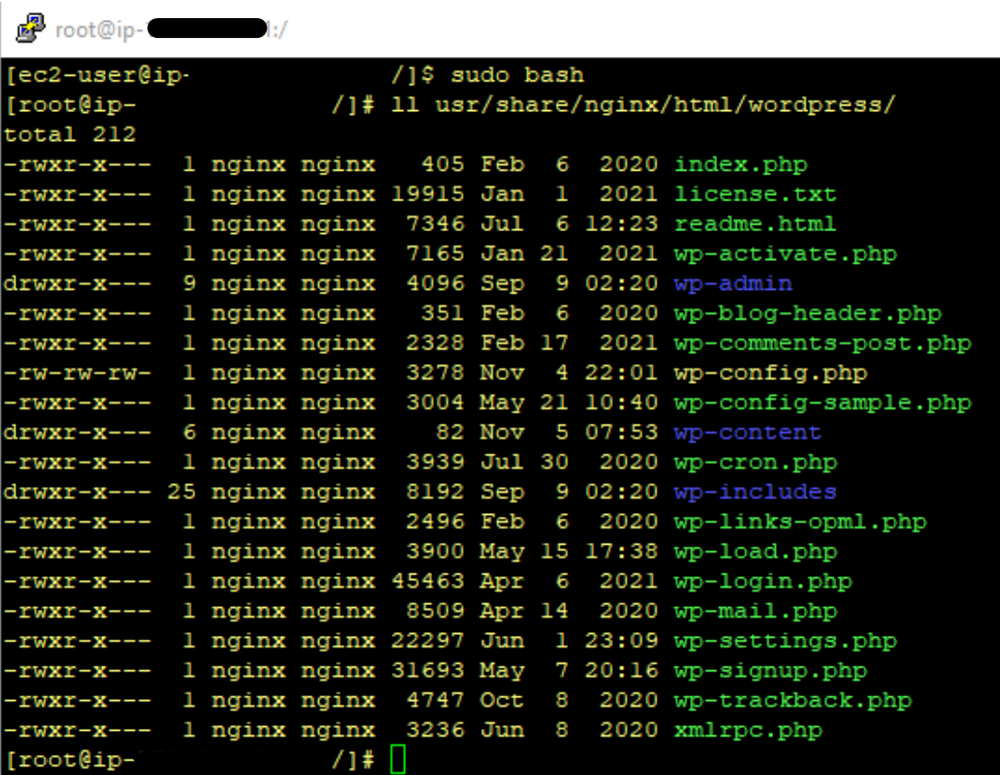

## 5.2. Entramos en MySQL 

Vamos a volver a crear un usuario y una BBDD para el nuevo wordpress de Nginx

`mysql -u root -p`

`CREATE USER 'wp'@'localhost' IDENTIFIED WITH` 

`mysql_native_password BY 'xxx';`

`CREATE DATABASE wp;`

`GRANT ALL PRIVILEGES ON wp.* TO "wp"@"localhost";`

`FLUSH PRIVILEGES;`

## 5.3. Ahora vamos a crear y configurar un nuevo server block para wordpress

- Vamos hacia /etc/nginx/conf.d/
- Creamos el archivo wordpress.conf

`sudo vi etc/nginx/conf.d/wordpress`

Nota: Como ya tenemos el server block de mi servidor principal, tan sólo habría que cambiarle un par de palabras... 

Para ello vamos a copiar éste y a cambiarle el nombre a wordpress.conf

`sudo cp /etc/nginx/conf.d/tudominio.com.conf /etc/nginx/conf.d/wordpress.conf`

- Entramos en el nuevo archivo de wordpress.conf y le cambiamos el principio a:

```
server {
  listen 80;
  server_name wordpress.tudominio.com;
  root /usr/share/nginx/html/wordpress;
  index index.php index.html index.htm;
  charset UTF-8;
```

- Paralelamente a esto, tenemos que ir ahora a IONOS 

Vemos si sigue creado mi subdominio de www.wordpress.tudominio.com , y de ser así, si sigue conectado a nuestra IP (servidor principal) a través del registro A de DNS ...

De no ser así, tendríamos que volver a crearlo y volver a asociarlo a nuestra IP ...

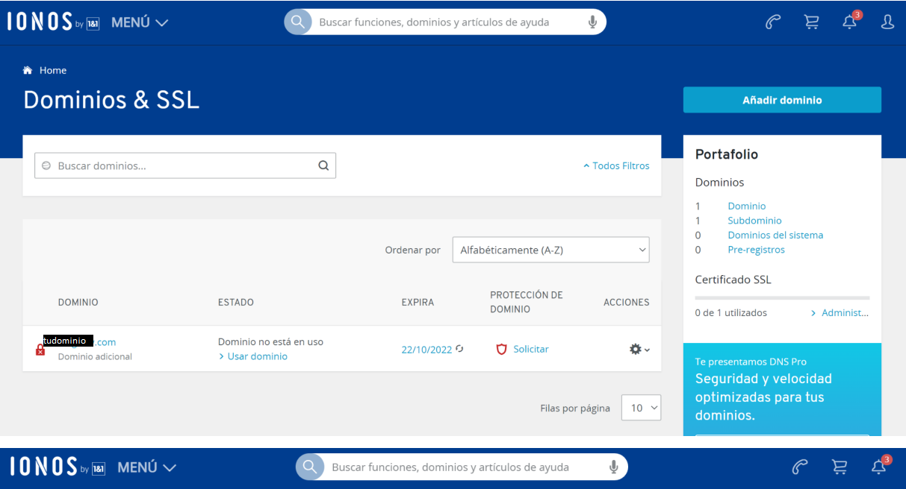

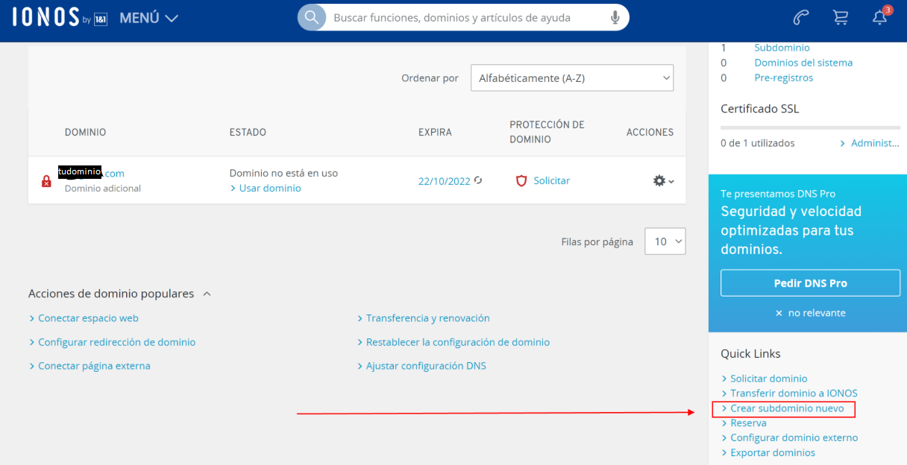

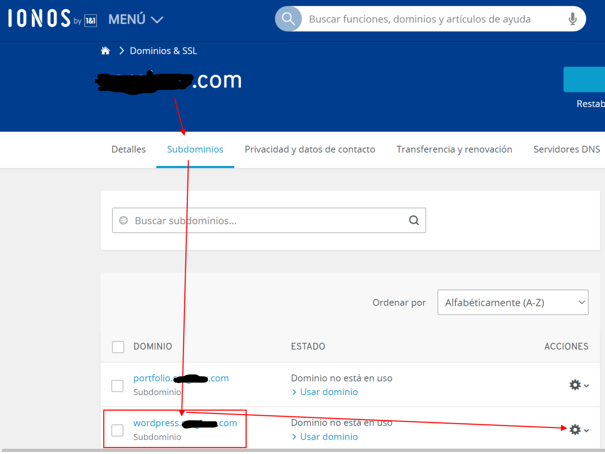

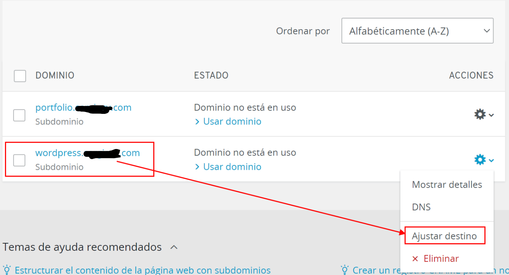

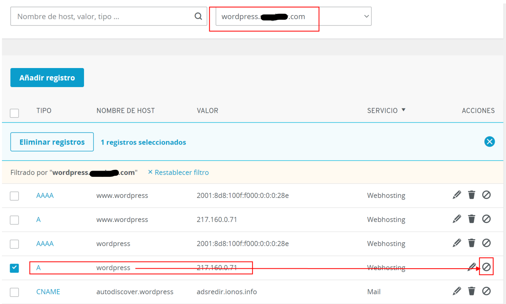

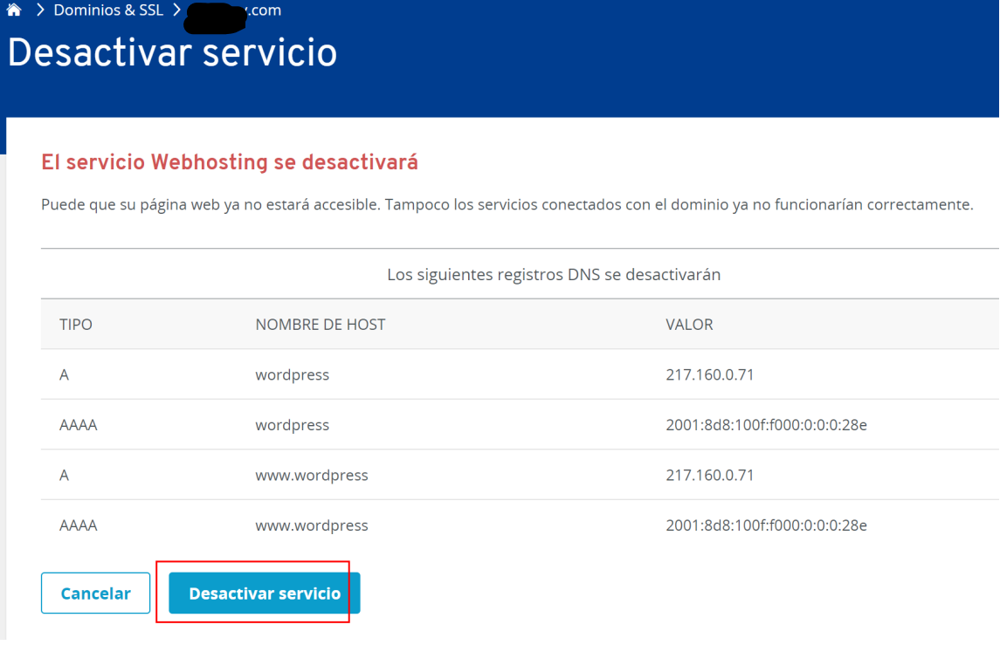

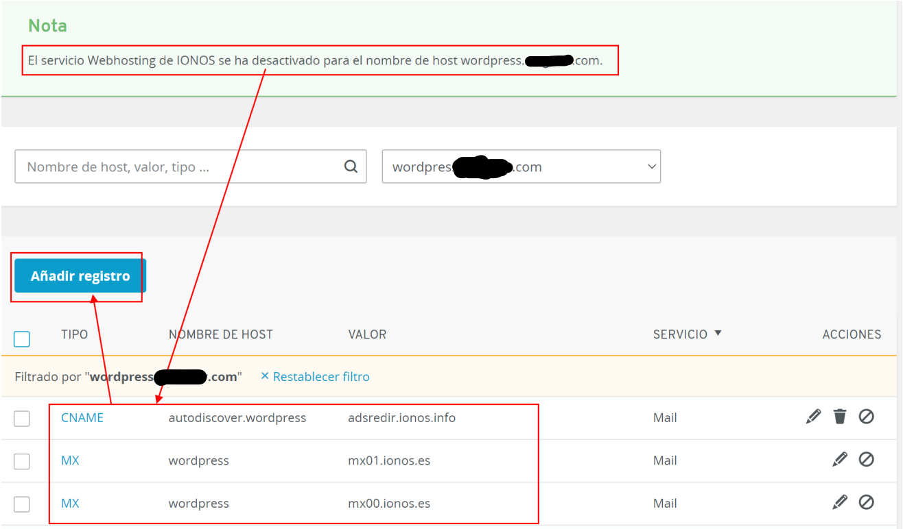

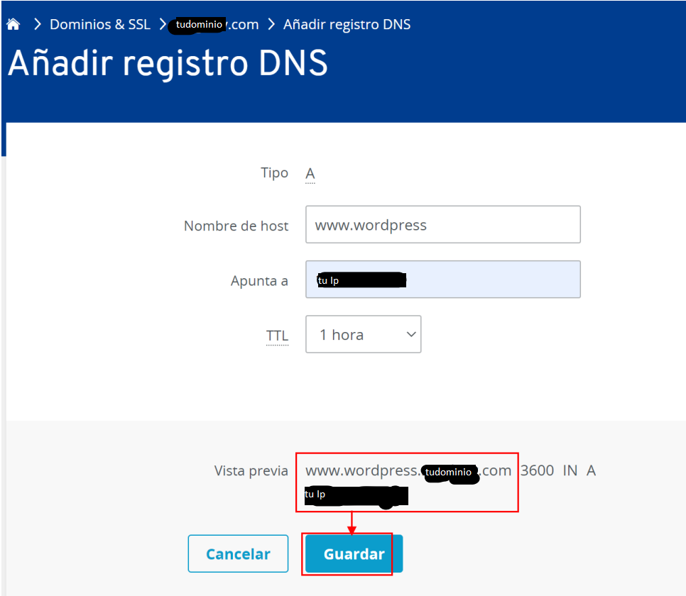

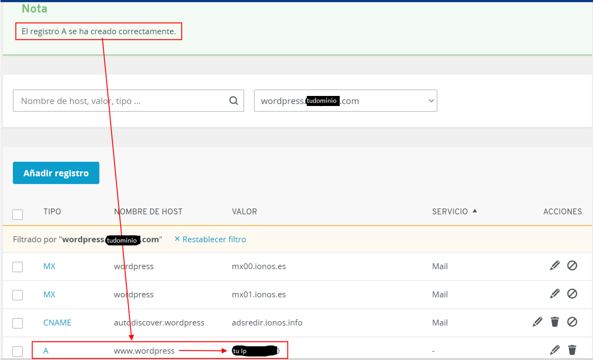

- Hacemos un sudo systemctl restart nginx

Y si ahora vamos al navegador y ponemos www.wordpress.tudominio.com, nos sale la intro de la instalación de wordpress para seleccionar el idioma...

```
db-wordpress: wp
user-db-wordpress: wp@localhost
pass-db-wordpress: tupassword
```

Para acceder a WordPress:

```
user: tuuser
pass: tucontraseña
email: tuemail
```

Procedemos a poner los datos necesarios y le damos al botón de “run installation”... 

y con esto ya estaría todo listo ! ...

¡¡ YA TENEMOS WORDPRESS también !!

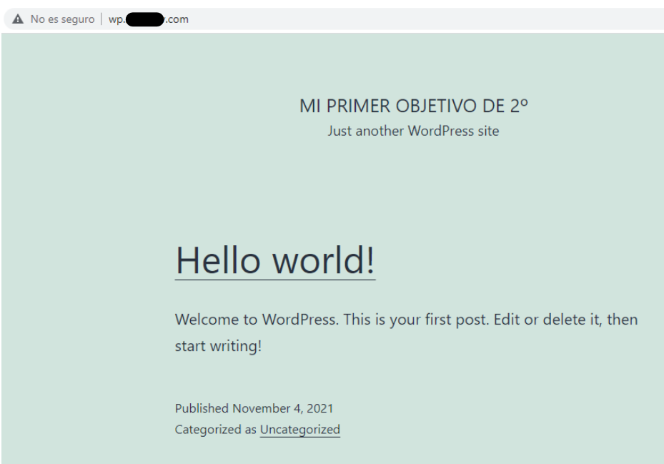

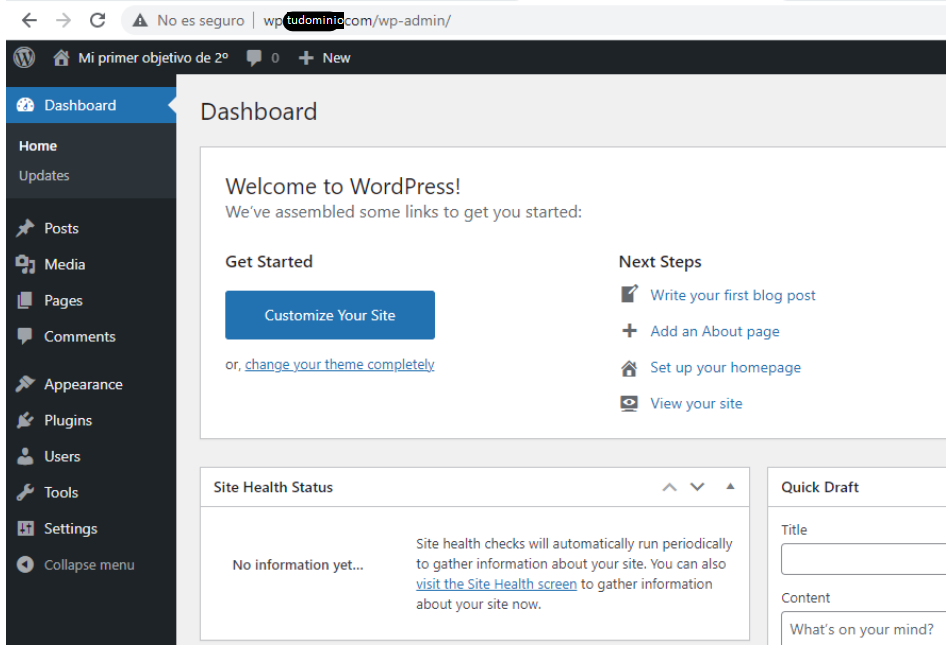

```
server {
  listen 80;
  server_name wordpress.tudominio.com;

  root /usr/share/nginx/html/wordpress;
  index index.php index.html index.htm;

  location / {
    try_files $uri $uri/ =404;
  }

  error_page 404 /404.html;

  location ~ \.php$ {
    try_files $uri =404;
    fastcgi_pass unix:/var/run/php-fpm/php-fpm.sock;
    fastcgi_index index.php;
    fastcgi_param SCRIPT_FILENAME $document_root$fastcgi_script_name;
    include fastcgi_params;
  }

  include fastcgi_params;
  fastcgi_param  SCRIPT_FILENAME    $document_root$fastcgi_script_name;
  fastcgi_split_path_info ^(.+\.php)(/.+)$;
  fastcgi_index index.php;
}
```

# Preguntas de Examen:

> P: ¿Qué es Nginx?

> R: Nginx, es un servidor web de código abierto que, desde su éxito inicial como servidor web, ahora también es usado como proxy inverso, cache de HTTP, y balanceador de carga.

Nginx creado originalmente por Igor Sysoev, y tuvo su primer lanzamiento público en octubre de 2004. Igor concibió inicialmente el software como una respuesta al problema C10K, que se refiere al problema de rendimiento de manejar 10,000 conexiones concurrentes.

> P: ¿Cómo funciona Nginx?

> R: Nginx está diseñado para ofrecer un bajo uso de memoria y alta concurrencia. En lugar de crear nuevos procesos para cada solicitud web, Nginx usa un enfoque asincrónico basado en eventos donde las solicitudes se manejan en un solo hilo.

Con Nginx, un proceso maestro puede controlar múltiples procesos de trabajo. El proceso maestro mantiene los procesos de trabajo, y son estos lo que hacen el procesamiento real.

Algunas características comunes que se ven en Nginx incluyen:

- Proxy inverso con caché
- IPv6
- Balanceo de carga
- Soporte FastCGI con almacenamiento en caché
- Websockets
- Manejo de archivos estáticos, archivos de índice y auto indexación
- TLS / SSL con SNI

> P: ¿Qué es PHP-fpm?

> R: PHP-FPM es la implementación alternativa más popular de PHP FastCGI, que cuenta con características adicionales realmente útiles para sitios web de alto tráfico. Estas son algunas de ellas:

- Gestión avanzada que permite detener/arrancar procesos fácilmente.
- Posibilidad de iniciar hilos de procesos con diferentes uid/gid/chroot/environment y distintos php.ini; sustituye a safe_mode.
- Registro stdout y stderr.
- Reinicio de emergencia en caso de destrucción accidental del caché opcode.
- Soporte acelerado de subidas.
- Configuración de variable slowlog; para detectar qué funciones tardan en ejecutarse más de lo habitual.
- Basado en archivos de configuración php.ini.
- Mejora de FastCGI, como fastcgi_finish_request(); una función especial para detener y descargar todos los datos mientras se continúa haciendo un proceso más largo como la conversión de vídeos o el procesamiento de estadísticas.
- Estadísticas básicas (similar al módulo mod_status de Apache). ¡NUEVO!

> P: ¿Qué sinergia positiva existe entre Nginx y PHP-fpm?

> R: Nginx como servidor web de alto rendimiento estable, y con un consumo de recursos muy bajo, es el compañero ideal de PHP-FPM. Nginx tiene una arquitectura asíncrona que es mucho más escalable, basada en eventos. Además, al usar Nginx con PHP-FPM se mejora la eficiencia a nivel de consumo de memoria.

PHP funciona como un servicio separado al usar PHP-FPM. Al usar esta versión de PHP como intérprete del lenguaje, las peticiones se procesan a través de un socket TCP/IP; de modo que el servidor web Nginx solo maneja las peticiones HTTP y PHP-FPM interpreta el código PHP. El hecho de tener dos servicios separados es clave para ganar en eficiencia.

> P: ¿Qué relación existe entre Nginx y PHP-fpm?

> R: La relación que hay entre Nginx y PHP-fpm es que, Nginx necesita de PHP para leer archivos y funciones, y así “proyectarlos” en el navegador.
Nginx necesita poder ejecutar y controlar a PHP-fpm, ya que le manda a éste solicitudes para ejecutarlo y usarlo.

Para que PHP-fpm escuche las peticiones de Nginx:

- PHP-fpm escuchará a Nginx gracias a listen.acl_users = apache,nginx
Un usuario o proceso que no esté en esta lista llamada acl_users será ignorado y no se le atenderá.

- Nginx se comunica con PHP-fpm con el socket de PHP-fpm el cual es:
fastcgi_pass unix:/var/run/php-fpm/php-fpm.sock;

- Este socket lo ha creado php-fpm al activarse

Video Extra 1: https://www.youtube.com/watch?v=8B5wLDpkz0c

Video Extra 2: https://www.youtube.com/watch?v=HyxatbU40x8

Video Extra 3: https://www.youtube.com/watch?v=39uiw0NNozg
