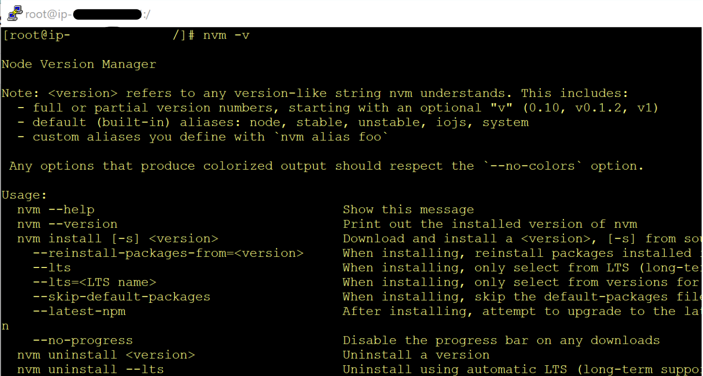
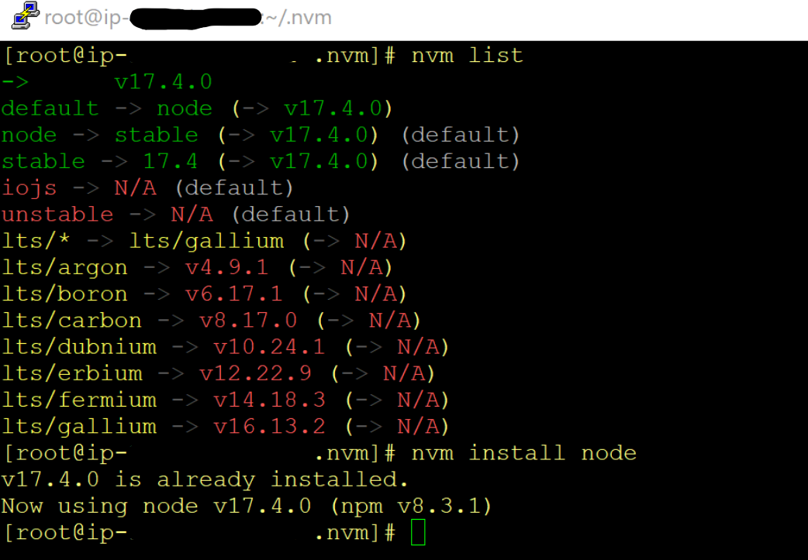
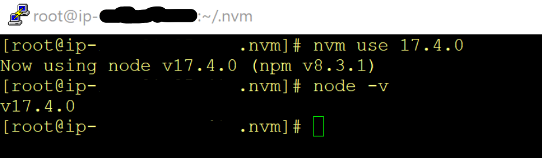
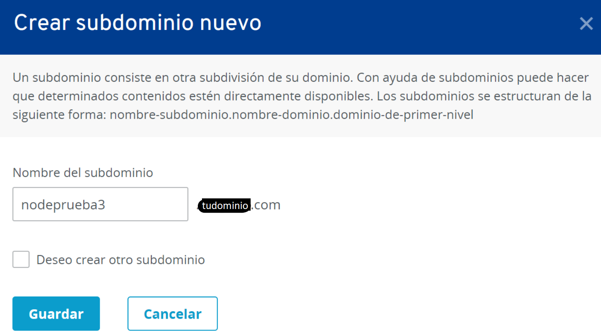
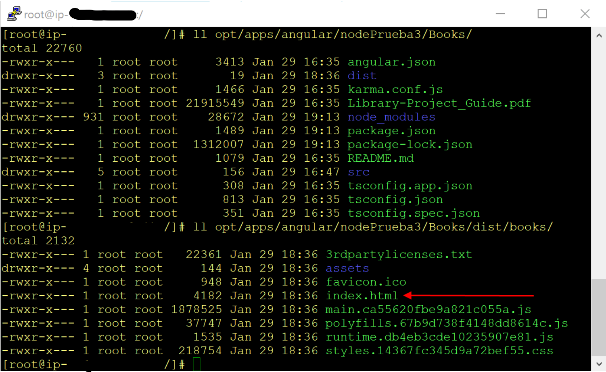
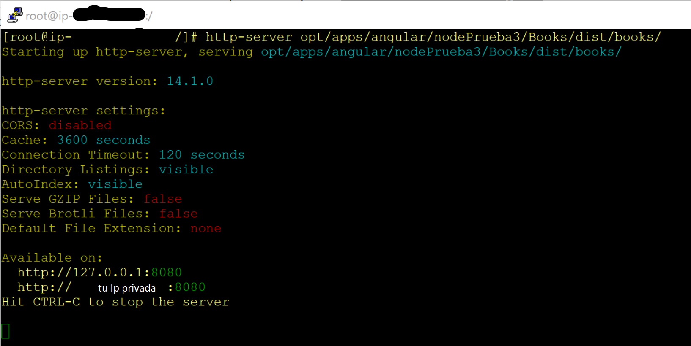
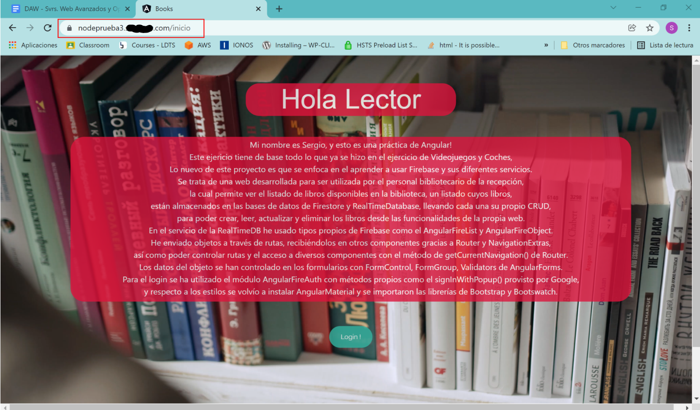

# Tabla de Contenidos

<!-- TOC -->

- [1. Node JS](#node-js)
    - [1.1. NVM CLI](#nvm-cli)
    - [1.2. Ejecutar el cli](#ejecutar-el-cli)
    - [1.3. NPM](#npm)
    - [1.4. Subir un proyecto al servidor](#subir-un-proyecto-al-servidor)
    - [1.5. Server Block](#server-block)
    - [1.6. Archivo js](#archivo-js)
    - [1.7. Creamos el subdominio](#creamos-el-subdominio)
    - [1.8. Reseteo y despliegue](#reseteo-y-despliegue)
- [2. Extra - Http-Server](#extra---http-server)
    - [2.1. Nuevo subdominio](#nuevo-subdominio)
    - [2.2. Server block](#server-block)
    - [2.3. Subimos un proyecto](#subimos-un-proyecto)
    - [2.4. Http-Server](#http-server)
    - [2.5. Reseteo y despliegue](#reseteo-y-despliegue)
        - [Nota sobre el examen](#nota-sobre-el-examen)
- [GNU Free Documentation License](#gnu-free-documentation-license)

<!-- /TOC -->

# 1. Node JS

Este es el objetivo más sencillo del curso, en comparación con los demás. Se trata de que tenemos que desplegar un proyecto a través de Node. 

Para lograr este objetivo, bastará con hacer el clásico ejemplo de crear un servidor web de HTTP pero con Node, en el cual vamos a coger el modelo de un archivo javascript, en el que definiremos un hostname, un puerto, y un servidor, con el típico mensaje de "Hello World" como una respuesta inmediata de tal servidor web.

Buscando rápidamente por Google, podemos encontrar fácilmente este tipo de ejemplo.

- De la documentación oficial de node.js.org: https://nodejs.org/api/synopsis.html#example
- Node.js Example – Create HTTP Web Server: https://www.tutorialkart.com/nodejs/node-js-examples/

## 1.1. NVM CLI

Vamos a la carpeta de /opt/ y creamos una carpeta llamada /opt/apps/ y en ella, ejecutamos el siguiente comando para descargar el CLI de NVM

`wget https://raw.githubusercontent.com/nvm-sh/nvm/v0.34.0/nvm.sh | bash`

**Nota**: Consulta cuál es la versión más actual en la documentación oficial de NVM: https://github.com/nvm-sh/nvm

## 1.2. Ejecutar el cli

Cada vez que entremos al servidor, y queramos usar el CLI de NVM, tendremos que abrir el archivo nvm.sh con el comando abrir (.)

`. /opt/apps/.nvm/nvm.sh`

Para comprobar si tenemos nvm instalado correctamente, veámos su versión: 

`nvm -v`



Para ver las distintas versiones que tenemos: 

`nvm list`



Para elegir una versión de NVM y habilitarla:

`nvm use x.xx`



## 1.3. NPM

Ahora vamos a instalar el gestor de paquetes NPM:

`npm install -g npm@x.x.x`


**Nota**: Para instalar la versión de npm más reciente y estable, en vez del número de la versión, poner latest:

`npm install -g npm@latest`

## 1.4. Subir un proyecto al servidor

Vamos a crear una carpeta para albergar en ella uno de mis proyectos de angular que he hecho en clase este año … mkdir /opt/apps/angular/nodePrueba1/

Para subir el proyecto, podemos hacerlo de dos formas:

- o bien subimos todo un proyecto entero por FileZilla
- o en el servidor hacemos el `git clone repository-url` y subimos por FileZilla sólo los módulos

**Nota**: No instalar los módulos desde el servidor, es decir, mejor no hacer el `npm install` en el servidor, porque algunos compañeros han experimentado cambios en su  configuración general del servidor, como hasta cambios de IPs, etc ...)

**Nota**: El proyecto debe tener hecho previamente el `npm build` (o `ng build`, o según cual sea el framework), es decir, debe contener también la carpeta de “dist”.

## 1.5. Server Block

Una vez que hemos subido el proyecto al servidor, si recordamos un poco sobre los anteriores objetivos, nosotros desplegamos nuestros anteriores proyectos a través de Nginx, y desde el anterior objetivo, todos van con Nginx SSL (es decir, https) ... es por ello por lo que debemos hacer, que nuestro proyecto de Node pueda escuchar a través del Nginx (Nginx proxy), creando para ello un nuevo server block y añadiendo el proxy_pass (cómo ya hicimos para el proyecto que desplegamos con Tomcat).

```
server {
   listen 443 ssl http2;
   server_name nodeprueba1.tudominio.com;

   include /etc/nginx/include/include.conf;

   location / {
      proxy_pass http://127.0.0.1:3000;
   }
}
```

## 1.6. Archivo js

Vamos a crear un archivo de javascript (con el nombre que quieras), en el que copiaremos y pegaremos el siguiente código, que encontramos antes en uno de los ejemplos de google:

```
const http = require('node:http');

const hostname = '127.0.0.1';
const port = 3000;

const server = http.createServer((req, res) => {
  res.statusCode = 200;
  res.setHeader('Content-Type', 'text/plain');
  res.end('Hello, World!\n');
});

server.listen(port, hostname, () => {
  console.log(`Server running at http://${hostname}:${port}/`);
});
```

**Nota**: Teniendo en cuenta el server block que hicimos antes... el hostname tiene que ser el localhost, y el puerto debe ser el 3000 porque es el que pusimos para el proxy_pass.

**Nota**: Se recomienda ubicar las aplicaciones y proyectos en el famoso directorio de /opt/ ... es decir, para mantener una buena organización, podríamos crear (o llevar) este archivo js hacia, por ejemplo, /opt/apps/node/x.js

## 1.7. Creamos el subdominio

En este paso simplemente tenemos que ir a Ionos a crear un nuevo subdominio (por ejemplo, nodeprueba1.tudominio.com) y asociarlo de nuevo a la ip de la instancia...

## 1.8. Reseteo y despliegue

Por supuesto, reseteamos Nginx, y si ya le hacemos el comando node al archivo js anterior...

`node [nombre].js`

... comprobamos que, efectivamenete se despliega, y si lo abrimos en Chrome, podemos ver que el Nginx Proxy vuelve a funcionar correctamente, ya que no necesitamos poner en la URL el 127.0.0.1:3000, si no que con poner nodeprueba1.tudominio.com ya se accede perfectamente.

# 2. Extra - Http-Server

Para repasar los pasos que hemos hecho en este objetivo, vamos a volver a repetir el proceso, pero esta vez, vamos a abrir otro proyecto desde un archivo que no sea js...

## 2.1. Nuevo subdominio

Igual que antes, tenemos que crear en Ionos un nuevo subdominio (apuntando a la ip de mi instancia, claro).



**Nota**: en mi caso, ya he hecho alguna que otra prueba, y por eso voy ya por el subdominio "nodeprueba3"

## 2.2. Server block

Volvemos a la configuración de Nginx para crear un nuevo server block

`vi /etc/nginx/conf.d/nodeprueba3.com.conf`

```
server {
   listen 443 ssl http2;
   server_name nodeprueba3.tudominio.com;

   include /etc/nginx/include/include.conf;

   location / {
      proxy_pass http://127.0.0.1:8080;
   }
}
```

**Nota**: Para el proxy_pass he puesto el puerto 8080, porque luego, cuando vaya a usar el Http-Server, éste utiliza predeterminadamente este puerto.

## 2.3. Subimos un proyecto

Vamos a crear un nuevo proyecto, o cogemos cualquiera que hayamos hecho durante el grado, y lo subimos al servidor con filezilla, o lo descargamos de GitHub en el servidor.

**Nota**: en mi caso, voy a reutilizar un proyecto de Angular.

**Nota**: No te olvides de generar la carpeta dist ejecutando el comando de `npm build` (o `ng build` en mi caso en Angular).

## 2.4. Http-Server

Vamos a instalar Http-Server.

`npm install http-server -g`

La idea de probar esta otra forma de despliegue la obtuve a través de pensar sobre cómo le haría el comando node a un archivo que no fuera javascript, como por ejemplo, un index.html de toda la vida.

El hecho de usar la herramienta Http-Server para apuntar hacia un archivo html y desplegar todo el proyecto al que éste iría ligado, lo encontré investigando esta web:

https://stackabuse.com/how-to-start-a-node-server-examples-with-the-most-popular-frameworks/

En el apartado de "Other Options for Starting a Server with Node.js", y dentro de "Using Other Server Modules", después del primer ejemplo que viene (que es el del js del objetivo anterior de node que ya hicimos), encontramos la información que habla sobre esta herramienta.

El extracto que habla sobre la herramienta Http-Server es el siguiente:

---

If all you want is a Node.js server to serve HTML and serve static files without you coding anything for the server, Node has a solution for that as well. In this case you need to install the http-server zero-configuration, command-line server to serve your files.

To use http-server, install it with the command npm install http-server -g.

In a fresh directory, create a child directory named public in which we will place static files for http-server to serve. Create a static HTML file inside this public directory named index.html with the following contents:

```
<!-- public/index.html -->
<html>
  <head>
    <title>Hello from http-server</title>
  </head>
  <body>

    <h1>Hello, World!</h1>

   </body>
</html>
```

Then you can run the http-server using the command:

`http-server ./public/`

This Node.js serving option is useful for serving a simple app that does mainly front-end work.

---

## 2.5. Reseteo y despliegue

Como siempre que tocamos la configuración de Nginx...

`systemctl restart nginx`

Y ahora solo queda ejecutar el comando http-server apuntando a la carpeta del proyecto donde se encuentra el index.html





**Nota**: Vemos que dice "Avaible on: http://127.0.0.1:8080", que es justo donde tenemos el proxy_pass.

Y si ahora vamos al Chrome y ponemos en la URL "nodeprueba3.tudominio.com", comprobamos que se accede de forma directa y segura al proyecto desplegado en cuestión.



### Nota sobre el examen

Nota: sobre el examen de este objetivo, será relativamente sencillo y liviano. Tan sólo deberás tener claro lo que es Node, NVM y NPM; y volver a repasar el Nginx Proxy, para lo cual, encontrarás fácilmente decenas de artículos en Google y decenas de videos en YouTube.

## GNU Free Documentation License

Copyright (C)  2022  Sergio Díaz Campos.
    Permission is granted to copy, distribute and/or modify this document
    under the terms of the GNU Free Documentation License, Version 1.3
    or any later version published by the Free Software Foundation;
    with no Invariant Sections, no Front-Cover Texts, and no Back-Cover Texts.
    A copy of the license is included in the section entitled "GNU
    Free Documentation License".
