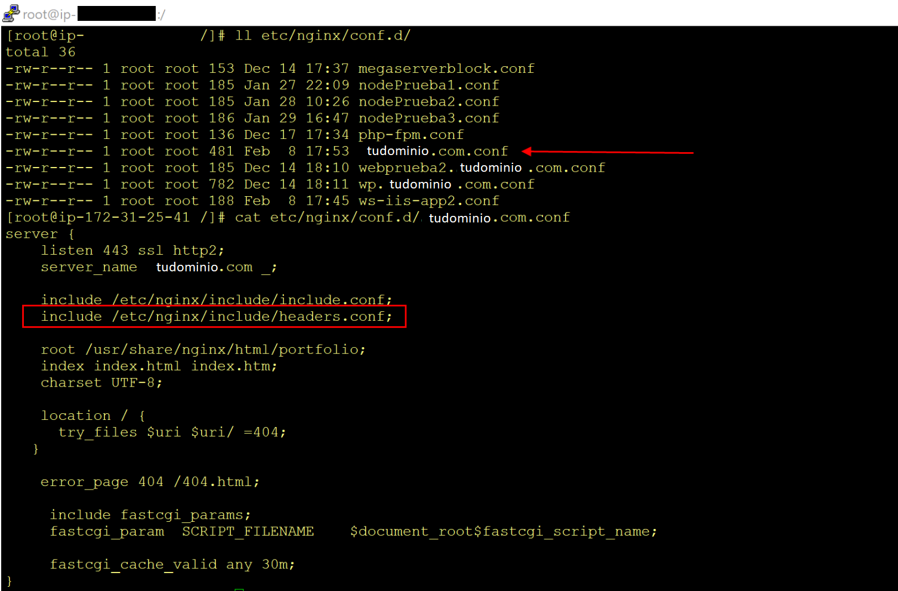
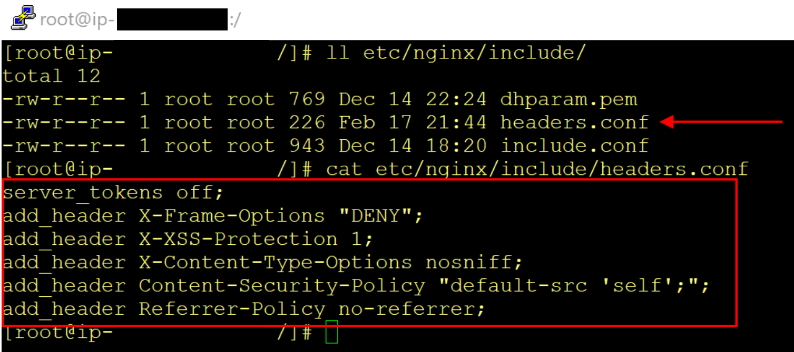
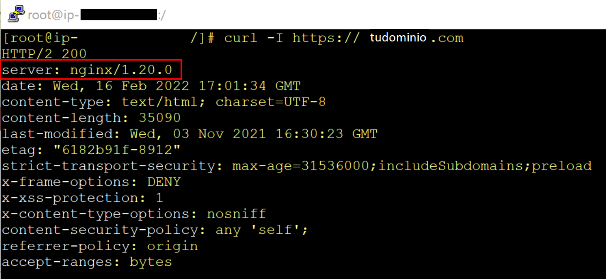
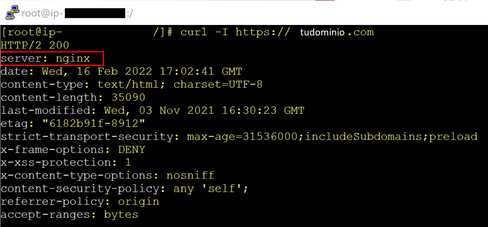
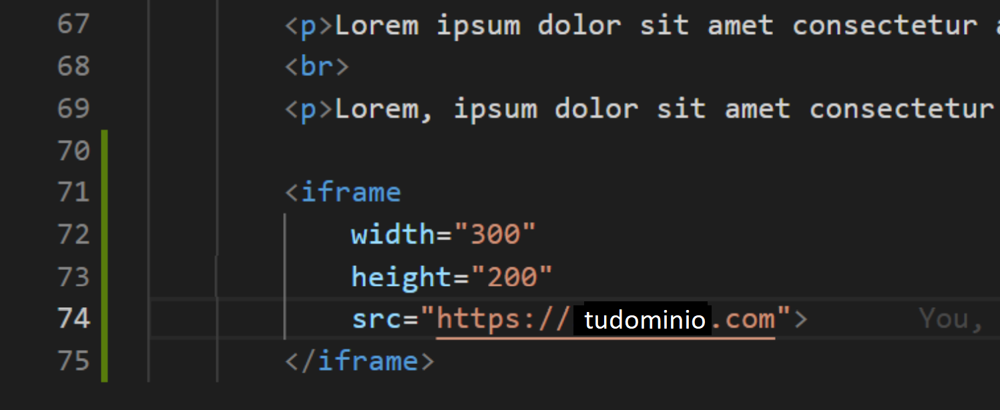
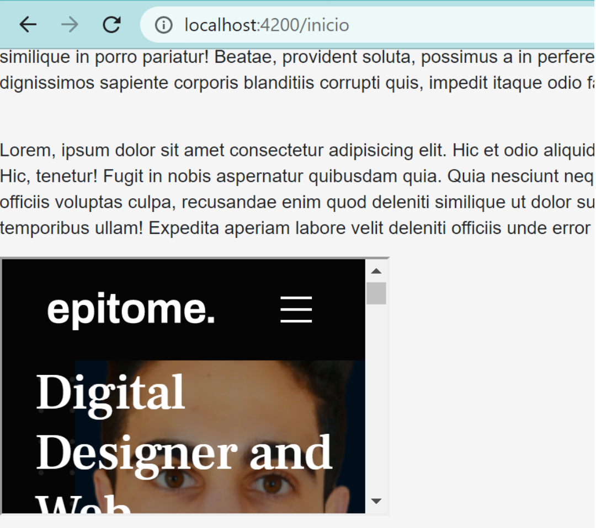
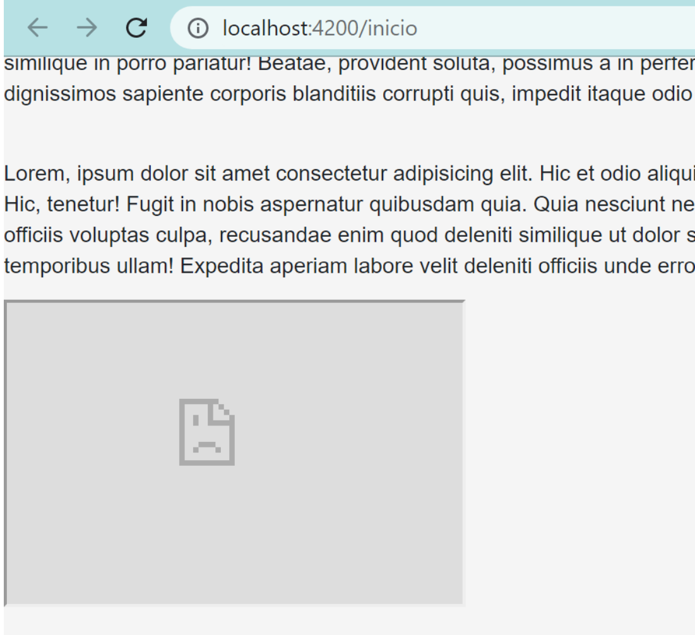
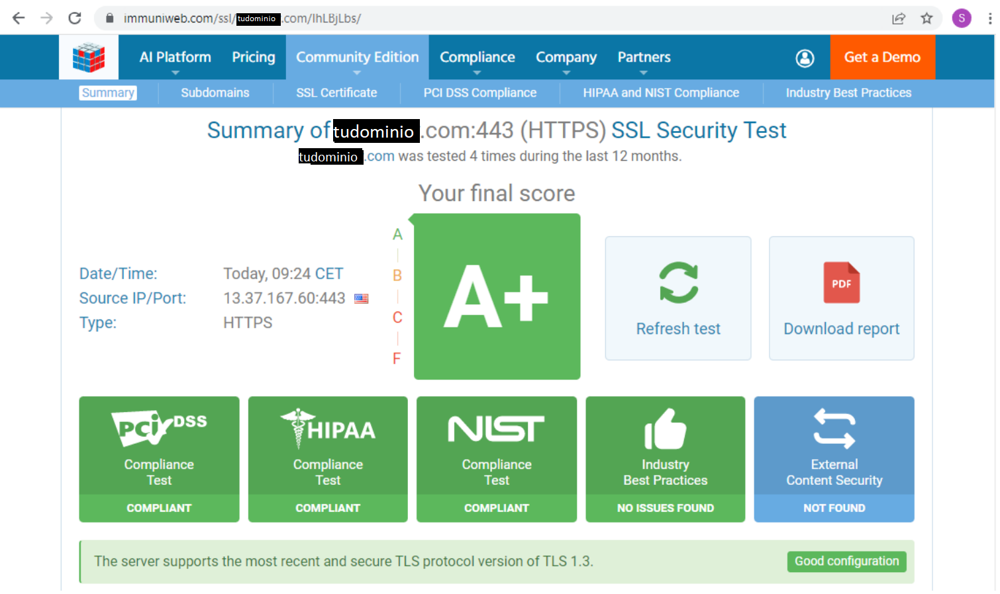

<!-- TOC -->

- [Headers](#headers)
    - [Importación include](#importaci%C3%B3n-include)
    - [headers.conf](#headersconf)
- [Explicación de los Headers](#explicaci%C3%B3n-de-los-headers)
    - [Server Tokens](#server-tokens)
    - [X-Frame-Options](#x-frame-options)
    - [X-XSS-Protection](#x-xss-protection)
    - [X-Content-Type-Options](#x-content-type-options)
    - [Content-Security-Policy Explicación 1](#content-security-policy-explicaci%C3%B3n-1)
        - [Función anti cross site scripting XSS](#funci%C3%B3n-anti-cross-site-scripting-xss)
        - [Función anti packet sniffing attacks](#funci%C3%B3n-anti-packet-sniffing-attacks)
        - [En Resumen](#en-resumen)
        - [Aplicación - Sintaxis del CSP](#aplicaci%C3%B3n---sintaxis-del-csp)
        - [Posibles Directivas de Política](#posibles-directivas-de-pol%C3%ADtica)
        - [Ejemplos](#ejemplos)
    - [Content-Security-Policy Explicación 2](#content-security-policy-explicaci%C3%B3n-2)
        - [Principales tipos de ataques XSS](#principales-tipos-de-ataques-xss)
        - [Acciones para prevenir un ataque XSS](#acciones-para-prevenir-un-ataque-xss)
        - [Definir el header Content-Security-Policy para los permisos a los contenidos de una web](#definir-el-header-content-security-policy-para-los-permisos-a-los-contenidos-de-una-web)
        - [Sources](#sources)
        - [Conclusión](#conclusi%C3%B3n)
    - [Referrer-Policy](#referrer-policy)
        - [Definición y configuración del Referrer-Policy header](#definici%C3%B3n-y-configuraci%C3%B3n-del-referrer-policy-header)
- [Análisis de seguridad](#an%C3%A1lisis-de-seguridad)
- [Extra: Preguntas prueba final](#extra-preguntas-prueba-final)
    - [X-Content-Type-Option](#x-content-type-option)
    - [X-Frame](#x-frame)
    - [XSS-Protection](#xss-protection)

<!-- /TOC -->

# 1. Headers

## 1.1. Importación (include)

Dentro del server block de mi dominio principal (el del portfolio, el de `tudominio.conf`), he añadido una sentencia más de include (importación de archivo), en la cual, importamos un nuevo archivo de configuración que contiene los headers que necesitamos que funcionen en nuestro dominio.



## 1.2. headers.conf

En la carpeta de “include” he creado un nuevo archivo de configuración (`headers.conf`), en el que he declarado los siguientes headers:



# 2. Explicación de los Headers

## 2.1. Server Tokens

> server_tokens off;

Sirve **para esconder la versión de Nginx** cuando se realiza una solicitud a nuestro servidor o cuando nuestro Nginx genera un error.

Podemos hacer las pruebas que queramos con el comando:

`curl -I https://elDominioQueQueramosProbar`

Si nos hacemos el comando a nosotros mismos antes de incluir el `server_tokens off;` podremos ver cómo aparece la versión de nuestro Nginx.



Si volvemos a hacer el comando después de incluir el `server_tokens off;` podremos ver cómo ya NO aparece la versión de Nginx.



## 2.2. X-Frame-Options

> add_header X-Frame-Options "DENY";

Esta cabecera **indica si debería permitirsele a un navegador renderizar una página en un `<frame>`**, `<iframe>`, `<embed>` u `<object>`.

Las páginas web pueden usarlo **para evitar ataques de click-jacking**, asegurándose de que su contenido no es embebido en otros sitios.

La seguridad añadida sólo es proporcionada si el usuario que está accediendo al documento está utilizando un navegador que soporte X-Frame-Options.

Este header tienen dos posibles directivas: “DENY” o “SAMEORIGIN”

Si especifica **DENY, fallarán no sólo los intentos de cargar la página en un marco desde otros sitios, sino que fallarán cuando sea cargada desde el mismo sitio**. Por otro lado, si especifica **SAMEORIGIN**, puede usar la página en un marco **mientras el sitio que la incluya sea el mismo que la sirve**.

He hecho una prueba simple en uno de mis proyectos de Angular, y he podido comprobar que, sin este header, pueden coger mi portfolio y que un `<iframe>` lo reproduzca embebido...





... y en cambio, cuando tengo este header, ya no funciona el `<iframe>` saltando un error que dice: `La página tudominio.com ha rechazado la conexión.`



## 2.3. X-XSS-Protection

> add_header X-XSS-Protection: 1;

El encabezado de respuesta HTTP X-XSS-Protection **es una característica de Internet Explorer, Chrome y Safari que impide la carga de una página cuando detecta ataques del tipo Cross-Site** (XSS (en-US)).

**Esta protección ya no es necesaria en los navegadores modernos cuando el sitio implementa una fuerte Content-Security-Policy** que deshabilita el uso de Javascript inline ('unsafe-inline').

Sin embargo **da protección a los usuarios de navegadores más antiguos que no soportan CSP** (en-US).

Este header dispone de las siguientes directivas posibles:

- X-XSS-Protection: 0

- X-XSS-Protection: 1

- X-XSS-Protection: 1; `mode=block`

- X-XSS-Protection: 1; `report=<reporting-uri>`

**0** → **Desactiva el filtro** XSS.

**1** → **Habilita el filtro** XSS (generalmente está predeterminado en los navegadores). En caso de detección de un ataque cross-site scripting, el navegador sanará la página (**eliminará las partes inseguras**).

**1; mode=block** → Habilita el filtrado XSS. **En vez de sanar la página, el navegador evitará la visualización de la página** en caso de que algún ataque sea detectado.

**1; report=<reporting-URI>** (Chromium solamente) → Habilita el filtro XSS. En caso de que algún ataque de cross-site scripting sea detectado, **el navegador sanará la página e informará sobre la infracción**. Utiliza la funcionalidad de la directiva CSP report-uri (en-US) para enviar un reporte.

## 2.4. X-Content-Type-Options

> add_header X-Content-Type-Options nosniff;

Antes de explicar para qué sirve esta cabecera, necesitamos conocer de
antemano ciertos conceptos...

El tipo Extensiones multipropósito de Correo de Internet (MIME) (**Multipurpose Internet Mail Extensions or MIME** type) **es una forma estandarizada de indicar la naturaleza y el formato de un documento, archivo o conjunto de datos**.

La Autoridad de Números Asignados de Internet (IANA) es el organismo oficial responsable de realizar un seguimiento de todos los tipos MIME oficiales, y se pueden encontrar la lista más actualizada y completa en la página de tipos de medios (Media Types).

https://www.iana.org/assignments/media-types/media-types.xhtml

**Los navegadores a menudo usan el tipo MIME** (y no la extensión de archivo) **para determinar cómo se procesará un documento**; y por lo tanto, **es importante** que los servidores estén configurados correctamente **para adjuntar el tipo MIME correcto al header del objeto de respuesta**.

Ejemplos que conozco de mi proyecto del año pasado en Lenguaje de Marca:

```html
<script type="text/javascript" src="vanilla-tilt.min.js"></script>
<link type="text/css" href="bootstrap-readable.min.css" />
```

Dicho todo esto, ahora sí podemos explicar que el header HTTP de respuesta **X-Content-Type-Options es un marcador utilizado por el servidor para indicar que los tipos MIME anunciados en los headers Content-Type no se deben cambiar** ni seguir. Esto permite desactivar el MIME type sniffing, o, en otras palabras, es una manera de decir que los webmasters sabían lo que estaban haciendo.

**Nota**: Content-Type es la propiedad de cabecera (header) usada para indicar el media type (en-US) del recurso, es decir, que Content-Type dice al cliente qué tipo de contenido será retornado.

**Nota**: El Olfateo MIME (sniffing) **es la práctica de los navegadores que consiste en que, en ausencia de un tipo MIME**, o en algunos otros casos en los que un cliente cree que están configurados incorrectamente, **los navegadores pueden realizar el rastreo MIME, que es adivinar el tipo MIME correcto mirando el recurso**. Cada navegador realiza esto de manera diferente y bajo diferentes circunstancias. **Hay algunas preocupaciones de seguridad con esta práctica, ya que algunos tipos MIME representan el contenido ejecutable y otros no...** con lo que, sin querer, **tu navegador al rastrear el contenido de un recurso malicioso, si éste es un ejecutable, pues ejecutará el script malicioso en el ordenador del cliente**.

**Nota**: Un webmaster o administrador de sitio web, es la persona responsable del mantenimiento o programación de uno o más sitios web.

Este header fue introducido por Microsoft en IE 8 para que los webmasters bloquearan el rastreo de contenido, pudiendo transformar tipos MIME no ejecutables en tipos MIME ejecutables. Desde entonces, otros navegadores lo han introducido, incluso con algoritmos de detección MIME menos agresivos.

Los evaluadores de seguridad del sitio suelen esperar que este header aparezca. 

**La directiva de este header es nosniff, la cual bloquea una solicitud, si el tipo solicitado es**:

- **"style"** y el tipo MIME no es **"text/css"**, o

- **"script"** y el tipo MIME no es un **"text/javascript"**

## 2.5. Content-Security-Policy (Explicación 1)

> add_header Content-Security-Policy: "default-src 'self';";

La Política de Seguridad del Contenido o ( CSP (en-US) ) - del inglés Content Security Policy - es una capa de seguridad adicional que ayuda a prevenir y mitigar algunos tipos de ataque, incluyendo Cross Site Scripting ( XSS (en-US) ) y ataques de inyección de datos. **Estos ataques son usados con diversos propósitos, desde robar información hasta la desconfiguración de sitios o distribución de malware**.

CSP está diseñado para ser completamente retrocompatible. Los navegadores que no lo soportan siguen funcionando con los servidores que lo implementan y viceversa: los navegadores que no soportan CSP simplemente lo ignoran, funcionando como siempre y delegando a la política mismo-origen para contenido web. Si el sitio web no ofrece la cabecera CSP, los navegadores igualmente usan la política estándar SAMEORIGIN.

**Nota**: En informática, la retrocompatibilidad, compatibilidad hacia atrás o compatibilidad regresiva (del inglés backward compatibility) es un concepto que, referido al software, indica la capacidad de una aplicación informática para utilizar datos creados con o pensados para versiones anteriores de ella misma, bien permitiendo abrirlos o incluso guardarlos con compatibilidad.

El término también hace referencia a la capacidad de un sistema de permitir la ejecución o el uso de versiones del software anteriores a la actual. Referido al hardware, representa la capacidad de ofrecer o soportar la funcionalidad de versiones anteriores de un dispositivo.

**Nota**: Para habilitar CSP, necesitas configurar tu servidor web para que devuelva la cabecera HTTP Content-Security-Policy (en ocasiones verás menciones de la cabecera X-Content-Security-Policy, pero se trata de una versión antigua y no necesitas especificarla más).

**Nota**3: Alternativamente, el elemento `<meta>` puede ser usado para configurar una política, por ejemplo: 

```html
<meta http-equiv="Content-Security-Policy" content="default-src 'self'; img-src https://*; child-src 'none';">
```

### 2.5.1. Función anti cross site scripting (XSS)

El principal objetivo del CSP es mitigar y reportar ataques XSS. **Los ataques XSS se aprovechan de la confianza del navegador en el contenido que recibe del servidor**. El navegador de la víctima ejecutará los scripts maliciosos porque confía en la fuente del contenido, aun cuando dicho contenido no provenga de donde se supone.

**CSP hace posible que los administradores de servidores reduzcan o eliminen las posibilidades de ocurrencia de XSS mediante la especificación de dominios que el navegador considerará como fuentes válidas de scripts ejecutables.**

Un navegador compatible con CSP solo ejecutará scripts de los archivos fuentes especificados en esa lista blanca de dominios, ignorando completamente cualquier otro script (incluyendo los **scripts inline y los elementos de HTML de manejo de eventos)**.

**Nota**: Como medida extrema de protección, los sitios que nunca requieran ejecutar scripts, pueden optar por rechazar globalmente la ejecución de scripts.

### 2.5.2. Función anti packet sniffing attacks

Además de restringir los dominios desde los cuales se puede cargar el contenido, el servidor puede especificar qué protocolos se pueden usar; por ejemplo (e idealmente, desde un punto de vista de seguridad), un servidor puede especificar que todo el contenido debe cargarse utilizando HTTPS.

**Nota**: Una estrategia completa de seguridad en la transmisión de datos incluye no solo aplicar HTTPS para la transferencia de datos, sino también marcar todas las cookies con el indicador de seguridad y proporcionar redirecciones automáticas desde las páginas HTTP a sus homólogas HTTPS.

**Nota**: Los sitios también pueden usar la cabecera HTTP Strict-Transport-Security (HSTS) para garantizar que los navegadores se conecten a ellos solo a través de un canal cifrado.

### 2.5.3. En Resumen

**CSP consiste en agregar a una página web la cabecera HTTP Content-Security-Policy, y darle valores para controlar los recursos que el agente de usuario puede cargar para esa página.**

Por ejemplo, una página que carga y muestra imágenes podría permitir imágenes desde cualquier lugar, pero pudiera restringir una acción de formulario a una ruta específica.

Una Política de Seguridad de Contenido adecuadamente diseñada ayuda a proteger una página contra un ataque de scripts entre sitios (XSS).

### 2.5.4. Aplicación - Sintaxis del CSP

Para especificar una política, se puede utilizar la cabecera CSP de la siguiente manera:

`Content-Security-Policy:` *`política`*

**La política es un string que contiene las directivas que describen una determinada Política de Seguridad de Contenido.**

### 2.5.5. Posibles Directivas de Política

**Una política debe incluir una directiva de políticas default-src (en-US), que es una alternativa para otros tipos de recursos cuando no tienen políticas propias** (para obtener una lista completa, consulte la descripción de la directiva default-src (en-US) ).

Una política debe incluir una directiva default-src (en-US) o script-src (en-US) para evitar la ejecución de scripts en línea, así como bloquear el uso de eval().

Una política debe incluir una directiva default-src (en-US) o style-src (en-US) para restringir la aplicación de estilos en línea desde un elemento `<style>` o un atributo style.

### 2.5.6. Ejemplos

➔ 1. Un administrador del sitio web desea que todo el contenido provenga del mismo origen que el del sitio (esto excluye subdominios).

`Content-Security-Policy: default-src 'self'`

➔ 2. El administrador de un sitio web desea permitir el contenido de un dominio de confianza y todos sus subdominios (no tiene que ser el mismo dominio en el que está configurado el CSP).

`Content-Security-Policy: default-src 'self' *.trusted.com`

➔ 3. El administrador de un sitio web desea permitir que los usuarios de una aplicación web incluyan imágenes de cualquier origen en su propio contenido, pero restringen los medios de audio o video a proveedores de confianza, y todas las secuencias de comandos solo a un servidor específico que aloja un código de confianza.

`Content-Security-Policy: default-src 'self'; img-src *; media-src media1.com media2.com; script-src userscripts.example.com`

**Nota**: Aquí, de forma predeterminada, el contenido solo se permite desde el origen del documento, con las siguientes excepciones:

- Las imágenes pueden cargarse desde cualquier lugar (tenga en cuenta el comodín "*").
- Los archivos de medios solo están permitidos desde media1.com y media2.com (y no desde los subdominios de esos sitios).
- El script ejecutable solo está permitido desde userscripts.example.com.

➔ 4. El administrador de un sitio web de banca en línea quiere asegurarse de que todo su contenido se cargue mediante SSL, para evitar que los atacantes puedan espiar las solicitudes.

`Content-Security-Policy: default-src https://onlinebanking.jumbobank.com`

**Nota**: El servidor solo permite el acceso a documentos que se cargan específicamente a través de HTTPS a través del único origen onlinebanking jumbobank.com.

➔ 5. El administrador de un sitio de correo web desea permitir HTML en el correo electrónico, así como imágenes cargadas desde cualquier lugar, pero no JavaScript u otro contenido potencialmente peligroso.

`Content-Security-Policy: default-src 'self' *.mailsite.com; img-src *`

**Nota**: Tenga en cuenta que este ejemplo no especifica un script-src (en-US) ; con el CSP de ejemplo, este sitio utiliza la configuración especificada por la directiva default-src (en-US), lo que significa que los scripts solo se pueden cargar desde el servidor de origen.

**Nota**: Para investigar aún más de cerca, una a una, todas las posibilidades de directivas que ofrece CSP, y poder ver un listado de ellas, e incluso ejemplos de las mismas, visitar directamente la propia web oficial de CSP: https://content-security-policy.com/

## 2.6. Content-Security-Policy (Explicación 2)

> add_header Content-Security-Policy: "default-src 'self';"

**Un ataque XSS consiste en que alguien inyecta código malicioso en una web** aparentemente normal, **y que luego se ejecuta en la computadora de la víctima**.

Este código inyectado puede hacer cosas como:

- copiar tus cookies y enviarlas al atacante.
- obtener información sobre su ubicación o datos de su cámara web, etc.
- tomar tokens de sesión del almacenamiento local.

**En sitios web que almacenan información confidencial**, como sitios web bancarios o de compras, **las vulnerabilidades XSS podrían permitir que alguien se haga pasar por usted robando su token de acceso y usándolo para iniciar sesión como usted**.

### 2.6.1. Principales tipos de ataques XSS

➔ 1. Stored XSS

Stored XSS se refiere al **código malicioso enviado en la respuesta del servidor desde una base de datos**.

Ejemplo: una web que permite a las personas enviar comentarios para debatir artículos de noticias, y un usuario envía el siguiente comentario:

```html
Great stuff guys!<script>/* código malicioso */</script>
```

**Si la web no está sanando ninguna entrada del usuario y está procesando el comentario directamente en el DOM, ese script se ejecutará tan pronto como cargue la página en la que se encuentra.** (y como consecuencia, antes de que te des cuenta, tu navegador ha publicado comentarios en todo el sitio declarando tu apoyo a una organización profundamente desagradable...).

Hay un episodio realmente interesante del podcast Darknet Diaries con Samy, el creador (accidental) de un “gusano” de MySpace, que usó XSS para obtener perfiles de gente y agregarlos automáticamente como amigos. Este es un gran ejemplo de XSS almacenado, porque todo comenzó con algo que publicó en su propio perfil (que luego se almacenó en la base de datos de MySpace). https://darknetdiaries.com/transcript/61/

➔ 2. Reflected XSS

Aquí es donde **la entrada de un usuario malicioso en una solicitud, se devuelve en la respuesta inmediata del servidor, ejecutándose en el navegador del cliente receptor**.

Ejemplo: alguien publica un enlace en línea a un sitio web de compras, con un término de búsqueda en la URL para que lo lleve directamente a la página del catálogo. Pero también incluyeron algunas etiquetas `<script>` en el string de la consulta.

```html
https://niche-tshirts.com/shirts?q=extreme+ironing<script>/* código malicioso */</script>
```

Cuando el servidor recibe la solicitud, toma el string de consulta completo y lo usa como parámetro de búsqueda. En el HTML que devuelve, representa:

```html
<p>
You searched for: amateur paleontology<script>/* código malicioso */</script>
</p>
```

Luego, su pobre y desprevenido navegador, ejecutará lo que hay entre esas etiquetas de script, y el atacante podrá obtener su token de acceso y cualquier otra cosa que haya logrado raspar.

➔ 3. DOM-based XSS

Finalmente, XSS basado en DOM es **cuando el JavaScript que se ejecuta en la página usa datos de algún lugar que el atacante puede controlar, como window location** (la URL de la página), **o como LocalStorage**.

Digamos que tenemos algo de JS en nuestra página que toma window.location y luego ejecuta alguna función con él:

```html
https://niche-tshirts.com/shirts?q=spelunking
```
```js
const params = new URLSearchParams(document.location.search.substring(1))
const searchTerm = params.get("q") 
document.getElementById("content").innerHTML = `<p>You searched for: ${searchTerm}</p>`
```

Si nuestro atacante anterior enviase otro enlace con las etiquetas `<script>` en el string de consulta, estas etiquetas `<script>` se procesarán en el DOM cuando el navegador establezca el contenido HTML interno del elemento #content.

A diferencia de los dos ejemplos anteriores, todo esto sucede en el lado del cliente, y el servidor no está involucrado en absoluto.

### 2.6.2. Acciones para prevenir un ataque XSS

Algunos de los métodos que podemos usar para prevenir ataques XSS en nuestra web son:

- **Desinfectar las entradas del usuario**, asegurándose de que no haya etiquetas HTML en ellas.

- Evitar ciertos caracteres (como <, >, & y ") con codificación de entidad HTML (por ejemplo, &amp; para &) para evitar que se ejecuten.

- No renderizar contenido arbitrario del servidor como HTML - renderizarlo como texto sin formato (plain text).

- **Verifique que el Content-Type sea correcto**: sólo text/html si definitivamente está devolviendo HTML.

- Use cookies HttpOnly para datos confidenciales para que la API de JavaScript Document.cookie no pueda acceder a ellos.

- y... **¡configure un header de Content-Security-Policy!**

### 2.6.3. Definir el header Content-Security-Policy para los permisos a los contenidos de una web

Content-Security-Policy es una capa adicional de seguridad en una web, que evita que se ejecuten cosas como scripts maliciosos, definiendo por tanto reglas estrictas sobre qué contenido puede y no puede tener en una web.

Puede ser uno de los encabezados HTTP que podemos enviar desde el servidor web al cliente (navegador), o una metaetiqueta en el `<head>` de una página HTML.

**Un navegador leerá el CSP y verificará si los scripts, las hojas de estilo y otros recursos, se están ejecutando o mostrando conforme con las reglas de la política previamente establecida.** Si no es así, no los cargará.

Un header de CSP o el contenido de la meta-etiqueta, siempre **es un string que contiene una lista de reglas separadas por punto y coma**.

**Una política tiene una lista de directivas que generalmente tienen el sufijo *-src* y se refieren a diferentes tipos de reglas para recursos y contenidos en la web.**

Algunas categorías comunes de directivas son:

- **Directivas Fetch**: qué tipos de recursos se pueden cargar y de dónde.

- **Directivas Document**: qué propiedades puede tener el documento.

- **Directivas Navigation**: hacia a dónde un usuario en la web puede navegar a/enviar un formulario.

Junto a cada directiva especificamos una o más sources permitidas para cada una de estas directivas.

**Nota**: Si bien el HTTP header y las metaetiquetas en su mayoría son iguales, las principales diferencias son que los encabezados HTTP tienen un soporte de navegador más amplio, admiten todas las directivas (las metaetiquetas admiten la mayoría de las directivas) y los headers pueden ser almacenados en caché por proxies (las metaetiquetas no ser).

**Nota**: Siempre que utilice varios métodos de defensa contra XSS, incluido CSP, podrá protegerse a sí mismo (incluso en Internet Explorer). Es importante enfatizar aquí que CSP es una forma de proteger su sitio web contra XSS; pero no es suficiente por sí solo, ya que necesita complementarse con otros headers...

1. Directivas Fetch

Estas directivas **rigen qué tipos de recursos se pueden cargar y desde dónde**. Aquí se definirán cosas como imágenes, scripts, estilos y frames. 

Cualquiera de estas directivas también puede tener un valor comodín (*), que básicamente significa que "todo vale".

- **image-src**: Fuentes permitidas para cualquier imagen/favicons en la página.

- **script-src**: Fuentes permitidas para cualquier JavaScript en la página.

- **style-src**: qué tipo de CSS se permite cargar y de dónde.

- **font-src**: desde dónde se pueden obtener las fuentes especificadas por la regla CSS @font-face (por ejemplo, Google Fonts).

- **frame-src**: desde dónde los iframes pueden cargar contenido (por ejemplo, elementos Stripe).

- **connect-src**: a qué hosts puede su JavaScript realizar solicitudes (por ejemplo, una API, con búsqueda).

- **default-src**: el respaldo si alguna de las reglas no coincide con el recurso.

2. Directivas Document

Las directivas de documentos restringen el uso de plugins (como los `<embed>`) y nos permiten habilitar el modo sandbox (entorno aislado y seguro).

- **plugin-types**: le permite definir los tipos MIME permitidos para medios y elementos incrustados usando etiquetas `<embed>`. A día de hoy, rara vez se necesita usar `<embed>`, por lo que no se encontrará mucho con esta directiva.

- **sandbox**: ¡literalmente la única directiva que admite Internet Explorer! Esto le permite restringir el entorno del navegador en la web, bloqueando efectivamente todo: ventanas emergentes (popups), scripts, formularios, lo que sea. Tiene fuentes diferentes del resto de las directivas: puede especificar exactamente qué debe habilitarse en el modo sandbox. Eche un vistazo a la documentación de sandbox de MDN (Mozilla Developers) en sandbox para obtener más información. (MDN documentation on sandbox --> https://developer.mozilla.org/en-US/docs/Web/HTTP/Headers/Content-Security-Policy/sandbox)

3. Directivas Navigation

- **form-action**: si está utilizando formularios HTML tradicionales con atributos de acción, esta directiva especifica los URIs a los que se permite enviar el formulario.

- **frame-ancestors**: especifica qué páginas o URIs pueden incrustar(<embed>) iframes y otros marcos/contenido incrustable (embed content).

**Nota**: El URI (siglas de uniform resource identifier) o identificador uniforme de recursos (por su nombre en español) sirve para acceder a un recurso físico o abstracto por Internet. Dependiendo de la situación, el recurso puede ser de muchos tipos: por ejemplo, un URI puede identificar tanto una página web como al remitente o al destinatario de un correo electrónico. Las aplicaciones utilizan este identificador único para interactuar con el recurso o consultar información sobre el mismo.

Protocolos como HTTP o FTP funcionan gracias a esta sintaxis, ya que la forma de direccionamiento se establece en base a la estructura del URI. De este modo, el sistema identifica a qué información debe acceder, así como dónde y cómo.

### 2.6.4. Sources

La mayoría de las directivas tienen la misma lista posible de sources. Con la excepción del host source y el scheme source, todos se especifican entre comillas simples.

- **'self'**: cualquier cosa del mismo host está bien. Por lo tanto, un CSP para localhost.dev con *`image-src: 'self' y script-src: 'self'`* podría mostrar imágenes y ejecutar scripts desde localhost.dev.

- una **host source**: hosts externos de los que puede provenir el recurso.

Por ejemplo, `style-src: "https://myhost.com"` le permite incluir una hoja de estilo de myhost.com, por ejemplo, `<link rel="stylesheet" href="https://myhost.com/style.css"/>`.

Si suele utilizar *content delivery networks (CDN)*, deberá especificarlos aquí. También puede usar comodines para el subdominio de la URL y también restringir las cosas a puertos específicos. El protocolo es importante, por lo que una fuente de host con https:// no permitirá nada de http://

Por ejemplo, *`connect-src: 'self' https://*.localghost.dev`* permitirá cualquier cosa a través de HTTPS desde un subdominio de este sitio.

- un ***scheme source***: de qué esquema (protocolo) está bien obtener recursos. Principalmente https: o http:

- **'unsafe-inline'**: si se permiten las etiquetas `<style>` y/o `<script>` en línea.

- **'unsafe-eval'**: si JS puede o no usar la función eval(), la cual ejecuta código arbitrario de cualquier string que se le pase.

- **nonce**: puede especificar un nonce criptográfico indescifrable (un string codificado en base 64) que luego puede pasar a estilos o scripts en línea como un atributo, para permitir que se carguen en la página.

Esto significa que puede usar etiquetas en línea `<style nonce="mysecretstring">` o `<script>`, sin permitir indiscriminadamente todos los estilos en línea, marcando efectivamente sólo un conjunto específico de estilos en línea como "seguros".

Este string debe generarse aleatoriamente y no se puede adivinar, de lo contrario, básicamente no tiene sentido, ya que cualquiera podría entonces averiguar el hash y colocarlo en sus scripts inyectados.

- **hash** - por ejemplo, sha256 - `<su valor hash>`. 

Esta es una representación codificada en base64 de sus styles o scripts en línea, por lo que el navegador puede comparar el hash con su propio hash de `<style>` y/o `<script>` para asegurarse de que es real. 

Cualquier cosa que no coincida con el hash será ignorada. Los hashes son estáticos, mientras que los nonces se generan en el lado del servidor en cada carga de página.

- **ninguno**: ninguna coincidencia de URL, no se puede cargar nada en absoluto. 

Por ejemplo, si no uso iframes en mi web, tendría que especificar *frame-src: none*

**Nota**: Si está ejecutando una aplicación con un Express Server, puede configurarla fácilmente como uno de los headers de respuesta con *helmet-csp*; para ello, consulte los documentos de Helmet para obtener más información. (Helmet docs)

**Nota**: El método más seguro es tener el CSP más restrictivo posible y sólo agregar nuevas fuentes si está completamente seguro.

Incluya un *default-src: 'none'* para que, si ninguna regla coincide con un recurso, se bloquee éste.

### 2.6.5. Conclusión

¿Cuándo es seguro agregar nuevas fuentes a un encabezado de CSP?

Tal vez haya incluido una imagen o una hoja de estilo en su código, y su navegador se niega a mostrarla porque viola el CSP.

Antes de agregar la URL como fuente, considere:

- ¿Confía en ese sitio?
- ¿Qué tan específico puedes hacer el URI? (evite los asteriscos a menos que sea un host que usted controle)
- ¿Podría alojar el archivo en una fuente ya aprobada?
- ¿Podría agregar el archivo CSS a su repositorio en su lugar?

## 2.7. Referrer-Policy

> add_header Referrer-Policy origin;

Una de las mayores amenazas para nuestra privacidad cuando navegamos por Internet es el seguimiento que realizan las webs.

**Cuando pulsamos sobre un enlace, la web a la que llegamos sabe perfectamente desde dónde lo hemos hecho**, algo muy útil para analítica pero una grave violación de nuestra privacidad.

Por suerte, **gracias a las Referrer Policy, los administradores web pueden bloquear esos seguimientos**, y tener un mayor control sobre el seguimiento que se realiza a sus visitantes y ayudarles a que su navegación sea lo más privada posible.

**Nota**: Google Chrome, Mozilla Firefox y Opera son compatibles con estas nuevas cabeceras y las reconocen sin problemas, igual que el navegador base de Android, Safari en iOS y Google Chrome para ambos sistemas móviles.

Sin embargo, Internet Explorer y Opera Mini no son compatibles, a día de hoy, con ellas. Además, Microsoft Edge y Safari son compatibles con ellas parcialmente, por lo que solo pueden trabajar con algunas de ellas pero no con todas.

### 2.7.1. Definición y configuración del Referrer-Policy header

A la hora de configurar esta cabecera **podemos asignar 9 parámetros diferentes**, los cuales vamos a ver a continuación.

1. **«»**

Este parámetro vacío indica que, aunque la cabecera esté declarada, no se quiere utilizar ninguna Referrer Policy, por lo que el rastreo y el seguimiento serán los de siempre.

2. **no-referrer**

Este parámetro indica que nunca se envíe el origen del visitante al acceder a un link. De esta manera, todos los usuarios que llegan a una web desde otra configurada como no-referrer aparecerán con el origen NULL.

3. **no-referrer-when-downgrade**

Este parámetro hará que el navegador no envíe seguimiento cuando vayamos a visitar una web HTTP desde una HTTPS, aunque siempre se enviará cuando no sea así.

4. **same-origin**

Solo enviará el origen cuando el destino y el origen sean el mismo, por ejemplo, de una web HTTPS a una subweb de la misma también con HTTPS.

5. **origin**

Cuando accedamos a un enlace nos mostrará la URL principal de la página desde la que hemos accedido, pero no la URL completa a la subpágina que estábamos visitando.

6. **strict-origin**

Igual que la anterior, pero solo para conexiones HTTPS. Las conexiones HTTP devolverán un NULL.

7. **origin-when-cross-origin**

Se enviará la URL completa en las consultas internas, pero se enviará la URL general cuando sean consultas cruzadas (desde distintas webs o protocolos).

8. **strict-origin-when-cross-origin**

Similar a la anterior, pero cuando hay cambio de HTTPS a HTTP se devolverá un NULL.

9. **unsafe-url**

Siempre se enviará la URL completa.

# 3. Análisis de seguridad

Para verificar que nuestros headers están bien definidos y que están funcionando correctamente, debemos visitar la siguiente web y consultar nuestro dominio: https://www.immuniweb.com/



**Nota**: El requisito del profesor para poder hacer la prueba final y contestar a las preguntas sobre este objetivo, es obtener una **Nota** de `A+` en el análisis de seguridad de esta web sobre nuestro dominio.

# 4. Extra: Preguntas prueba final

¿En qué consiste el ...?

1. X-Content-Type-Option
2. X-Frame
3. XSS-Protection

## 4.1. X-Content-Type-Option

Este header evita que los navegadores procesen/ejecuten el contenido de los recursos de nuestra web al solicitarlos al servidor, cuando éstos recursos no tienen definido su tipo de recurso.

## 4.2. X-Frame

El header X-Frame-Options indica si se le permite a un navegador renderizar una página web dentro de un `<frame>`

Con este header se pueden evitar ataques de click-jacking, evitando que un usuario malintencionado pueda cargar nuestra web en la suya para engañar al cliente.

Este header tiene dos directivas:

- DENY: rechaza cualquier carga de nuestra web en un `<frame>`
- SAMEORIGIN: Una web puede cargar la nuestra en un frame, mientras que la página que la web también nos pertenezca.

## 4.3. XSS-Protection

El header de X-XSS-Protection detecta ataques XSS generales y sana/bloquea la carga de la web en cuestión donde el XSS es detectado.

Este header ya no es tan necesario ya que los navegadores tienen una característica propia que hace la función de este header.

Tiene 4 posibles directivas: 

- 0: filtro deshabilitado 
- 1: filtro habilitado (sana partes)
- 1: mode-block: bloquea toda la página.