# Tabla de Contenidos

<!-- TOC -->

- [Correo Electrónico - SPF](#correo-electr%C3%B3nico---spf)
- [1. Añadir el registro DNS](#a%C3%B1adir-el-registro-dns)
- [2. ¿Qué es un registro DNS tipo SPF?](#%C2%BFqu%C3%A9-es-un-registro-dns-tipo-spf)
        - [Resumen](#resumen)
    - [2.1. Formato del Registro SPF](#formato-del-registro-spf)
        - [Resumen](#resumen)
    - [2.2. Mecanismos(etiquetas) del Registro SPF](#mecanismosetiquetas-del-registro-spf)
        - [Resumen de nuestros mecanismos SPF](#resumen-de-nuestros-mecanismos-spf)
    - [2.3. Calificadores de Registro SPF](#calificadores-de-registro-spf)
    - [2.4. Ejemplos de cómo funciona SPF en diferentes situaciones](#ejemplos-de-c%C3%B3mo-funciona-spf-en-diferentes-situaciones)
        - [Ejemplo 1](#ejemplo-1)
        - [Ejemplo 2](#ejemplo-2)
        - [Ejemplo 3](#ejemplo-3)
- [3. Activar el email de IONOS](#activar-el-email-de-ionos)
        - [Comprobación final - prueba de email](#comprobaci%C3%B3n-final---prueba-de-email)
    - [Resources](#resources)
        - [Definir el registro SPF: configuración avanzada](#definir-el-registro-spf-configuraci%C3%B3n-avanzada)
        - [Cómo Microsoft 365 usa el marco de directivas de remitente SPF para evitar la suplantación de identidad](#c%C3%B3mo-microsoft-365-usa-el-marco-de-directivas-de-remitente-spf-para-evitar-la-suplantaci%C3%B3n-de-identidad)
- [4. Pasos siguientes: DKIM y DMARC](#pasos-siguientes-dkim-y-dmarc)
    - [4.1. Evitar el spoofing y el spam con SPF](#evitar-el-spoofing-y-el-spam-con-spf)
    - [4.2. Evitar el spoofing y el spam con DKIM](#evitar-el-spoofing-y-el-spam-con-dkim)
    - [4.3. Evitar el spoofing y el spam con DMARC](#evitar-el-spoofing-y-el-spam-con-dmarc)
- [5. Prueba final - Ejemplo práctico - Pregunta Teoría](#prueba-final---ejemplo-pr%C3%A1ctico---pregunta-teor%C3%ADa)
    - [¿Por qué Google pone el interrogante rojo?](#%C2%BFpor-qu%C3%A9-google-pone-el-interrogante-rojo)
    - [Respuesta](#respuesta)
- [GNU Free Documentation License](#gnu-free-documentation-license)

<!-- /TOC -->

# Correo Electrónico - SPF

# 1. Añadir el registro DNS

Entramos en IONOS para dirigirnos a la sección de administración de nuestro dominio, y vamos a **añadir un nuevo registro DNS**, esta vez, del **tipo SPF (TXT)**.

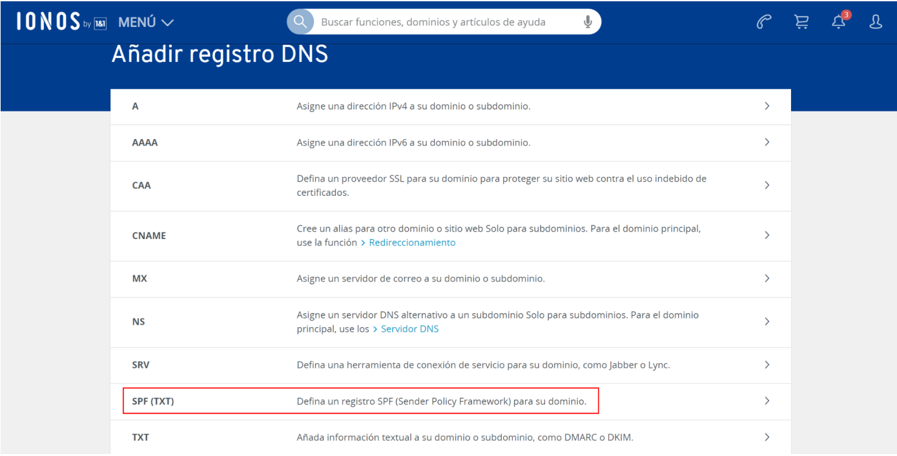

En el **campo del *valor***, tenemos que **incluir la siguiente sentencia**:

> v=spf1 a:tudominio.com include:_spf.perfora.net include:_spf.kundenserver.de include:_spf.firebasemail.com ~all

Esta sentencia la desglosaremos y explicaremos en las siguientes partes:

- v=spf1
- a:tudominio.com
- include:_spf.perfora.net
- include:_spf.kundenserver.de
- include:_spf.firebasemail.com
- ~all

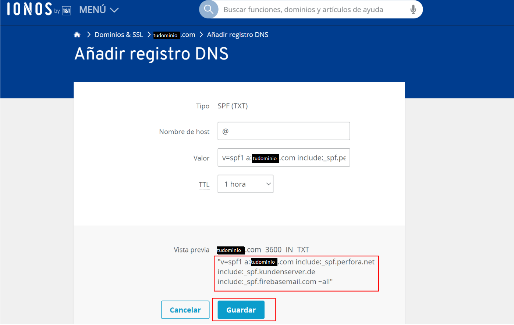

# 2. ¿Qué es un registro DNS tipo SPF?

El registro SPF **determina qué servidores de correo y dominios tienen permitido enviar correo en nombre de tu dominio**.

También indica a **los servidores que reciben tu correo** qué hacer con los mensajes una vez comprobados.

Esos servidores **comprueban tu registro SPF para confirmar que los mensajes que parecen proceder de tu organización se han enviado desde servidores autorizados**.

Los dominios solo pueden tener un registro SPF. Sin embargo, en el registro SPF de un dominio se pueden especificar varios servidores y terceros que tengan permitido enviar correo en nombre del dominio.

### Resumen

Un registro TXT SPF es un registro DNS que **ayuda a evitar la suplantación de IP y la suplantación de identidad (spoofing), y que con ello puedan intentar técnicas de phishing con clientes** o cualquier otros objetivos, y muchos servidores acabarán **marcando el dominio remitente como spam**; y todo ello mediante la comprobación del nombre del dominio desde el que se envían los mensajes de correo electrónico. 

**Para validar el origen de los mensajes de correo electrónico, SPF contrasta la dirección IP del remitente con el supuesto propietario del dominio de envío.**

## 2.1. Formato del Registro SPF

Un registro SPF **es una línea de texto sin formato que incluye una serie de etiquetas y valores**.

Las etiquetas se denominan mecanismos. Los valores suelen ser direcciones IP y nombres de dominio.

El registro SPF **se añade al proveedor del dominio en forma de registro TXT de DNS**.

Los registros SPF **pueden tener hasta 255 caracteres**. En cuanto al tamaño, el archivo del registro TXT no debe tener más de **512 bytes**.

`v=spf1 a:tudominio.com include:_spf.perfora.net include:_spf.kundenserver.de include:_spf.firebasemail.com ~all`

Mi Registro SPF tiene 110 caracteres, y también pesa 110 bytes.

### Resumen

Cada registro TXT SPF **contiene tres partes**: la **declaración**(1) de que se trata de un registro TXT SPF, las **direcciones IP**(2) que pueden enviar correo desde su dominio y los **dominios externos**(2) que pueden enviar en nombre de su dominio, y una **regla de cumplimiento**(3).

`v=spf1` `[<ip4>|<ip6>:<IP address>] [include:<domain name>]` `<enforcement rule>`

## 2.2. Mecanismos(etiquetas) del Registro SPF

Mecanismo | Descripción y valores permitidos
--------- | --------------------------------
**v**         | **Versión de SPF**. Esta etiqueta es obligatoria y tiene que ser la primera del registro. Debe tener este valor: `v=spf1`
**ip4**       | **Autoriza a servidores de correo mediante una dirección o un intervalo de direcciones IPv4.** El valor debe ser una dirección o un intervalo de direcciones IPv4 en formato estándar. Por ejemplo: `ip4:192.168.0.1` o `ip4:192.0.2.0/24`
**ip6**       | **Autoriza a servidores de correo mediante una dirección o un intervalo de direcciones IPv6.** El valor debe ser una dirección o un intervalo de direcciones IPv6 en formato estándar. Por ejemplo: `ip6:3FFE:0000:0000:0001:0200:F8FF:FE75:50DF` o `ip6:2001:db8:1234::/48`
**a**         | **Autoriza a los servidores de correo por su nombre de dominio.** Por ejemplo: `a:solarmora.com`
**mx**        | **Autoriza a uno o varios servidores de correo por el registro MX del dominio.** Por ejemplo: `mx:mail.solarmora.com`. Si no incluyes este mecanismo en tu registro SPF, el valor predeterminado son los registros MX del dominio en el que se usa el registro SPF.
**include**   | Autoriza a remitentes de correo externos por su dominio. Por ejemplo: `include:servers.mail.net`
**all**       | **Indica que todos los mensajes entrantes coinciden.** Te recomiendo que siempre incluyas este mecanismo en tu registro SPF. Tiene que ser el último mecanismo del registro SPF. Todos los mecanismos que haya después de `all` se ignorarán.

**Nota**: ¿Debo usar `~all` o `-all`?

Cuando un registro SPF incluye `~all` (calificador de que se supera la autenticación con reservas), **los servidores** que reciben correo **suelen aceptar** los mensajes de **remitentes que no figuran en el registro SPF, pero los marcan como sospechosos**.

Cuando un registro SPF incluye `-all` (calificador de fallo), **puede que los servidores que reciben correo rechacen los mensajes de remitentes que no figuren en el registro SPF**. Si tu registro SPF no está bien configurado y usas el calificador de fallo, puede que se marquen como spam más mensajes de tu dominio.

***Nota**: Para evitar el spoofing de dominios que no envían correo, usa este registro SPF en el dominio: `vspf1 ~all`*

### Resumen de nuestros mecanismos SPF

Mecanismo | Valor
--------- | -----------
v=spf1 | mecanismo "v"
a:tudominio.com | mecanismo "a"
include:_spf.perfora.net | mecanismo "include"
include:_spf.kundenserver.de | mecanismo "include"
include:_spf.firebasemail.com | mecanismo "include"
~all | mecanismo "all"

## 2.3. Calificadores de Registro SPF

Un calificador es un **prefijo opcional que se puede añadir a cualquier mecanismo** de los registros SPF.

Los calificadores **indican a los servidores que reciben correo si deben considerar que un mensaje está autenticado o no, cuando detectan que coincide con el valor de un mecanismo**.

**Los mecanismos se comprueban por orden de aparición** en el registro SPF.

- **Si un mecanismo no tiene calificador y un mensaje coincide**, de forma predeterminada **el mensaje supera la autenticación**.

- **Si un mensaje no coincide con ningún mecanismo**, de forma predeterminada se considera que **el mensaje no supera ni falla la autenticación**.

Podemos **incluir los siguientes calificadores para indicar** a los servidores que reciben correo **qué hacer con los mensajes que coincidan con alguno de los mecanismos** de tu registro SPF:

Calificador | Qué hace el servidor que recibe correo si detecta una coincidencia
--------- | -----------
**+** | **Se supera la autenticación.** Se autoriza a los servidores cuya dirección IP coincida a enviar correo en nombre del dominio. Se autentican los mensajes. Es lo que **ocurre de forma predeterminada** cuando los mecanismos no incluyen ningún calificador.
**-** | **No se supera la autenticación.** No se autoriza a los servidores cuya dirección IP coincida a enviar correo en nombre del dominio. El registro SPF no incluye la dirección IP ni el dominio del servidor remitente, por lo que los mensajes no superan la autenticación.
**~** | **Se supera la autenticación con reservas.** Es poco probable que los dominios cuya dirección IP coincida, estén autorizados a enviar correo en nombre del dominio. **El servidor que recibe correo suele aceptar estos mensajes, pero los marca como sospechosos.**
**?** | **Neutral. Ni se supera ni se falla la autenticación.** El registro SPF no indica de forma explícita si la dirección IP está autorizada a enviar correo en nombre del dominio. **Los registros SPF con resultados neutrales suelen incluir `?all`**

**Nota**: Nuestro mecanismo `~all` lleva el calificador del caracter *"virgulilla"* 

## 2.4. Ejemplos de cómo funciona SPF en diferentes situaciones

En estos ejemplos, *contoso.com* es el remitente y *woodgrovebank.com* es el receptor.

### Ejemplo 1

**Autenticación de correo electrónico de un mensaje enviado directamente del remitente al receptor.**

**Nota**: SPF funciona mejor cuando la ruta de acceso del remitente al receptor es directa.

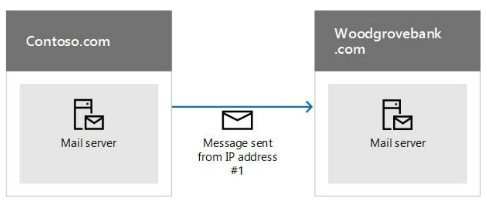

Cuando *woodgrovebank.com* recibe el mensaje, si la dirección IP #1 está en el registro TXT SPF para *contoso.com*, el mensaje supera la comprobación SPF y se autentica.

### Ejemplo 2

La dirección falsificada del remitente no supera la comprobación SPF.  Supongamos que un suplantador de identidad busca una forma de suplantar *contoso.com*

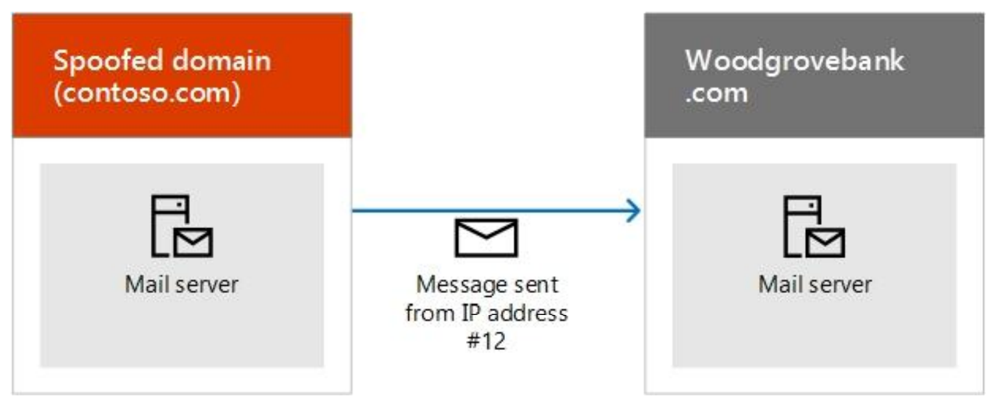

Como la dirección IP #12 no está en el registro TXT SPF de *contoso.com*, el mensaje no supera la comprobación SPF y el receptor puede marcarlo como correo no deseado.

### Ejemplo 3

**SPF y los mensajes reenviados.**

**Un inconveniente de SPF es que no funciona cuando se ha reenviado un correo electrónico.**

Por ejemplo, supongamos que el usuario de *woodgrovebank.com* ha configurado una regla de reenvío para enviar todo el correo electrónico a una cuenta de *outlook.com*

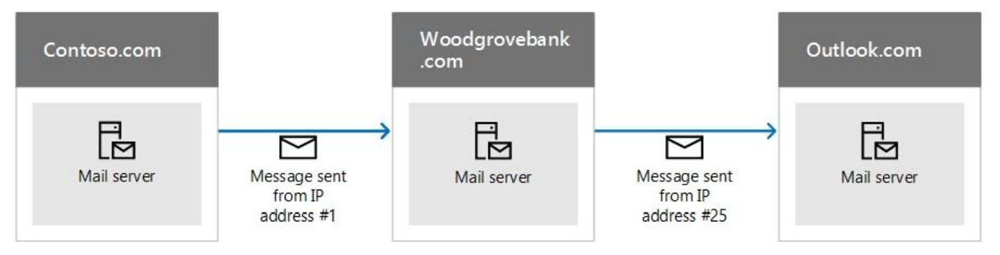

En un principio, el mensaje supera la comprobación SPF en *woodgrovebank.com* pero no supera la comprobación SPF en outlook.com, ya que la dirección IP #25 no se encuentra en el registro TXT SPF de *contoso.com.* *Outlook.com* puede marcar entonces el mensaje como correo no deseado. 

**Para solucionar este problema, use SPF junto con otros métodos de autenticación de correo electrónico como DKIM y DMARC.**

# 3. Activar el email de IONOS

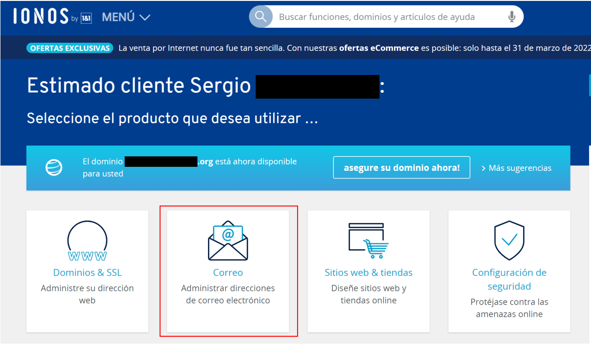

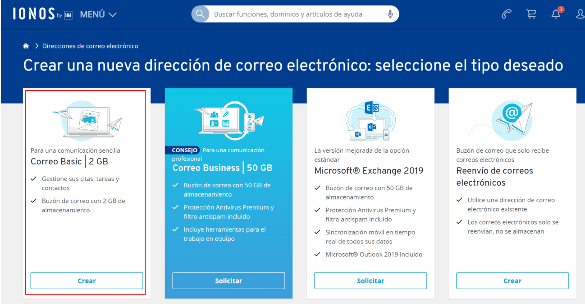

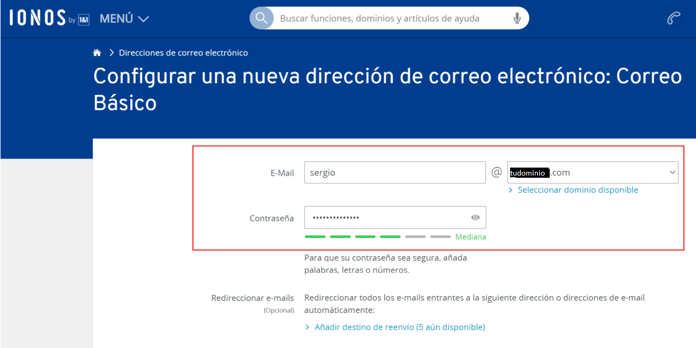

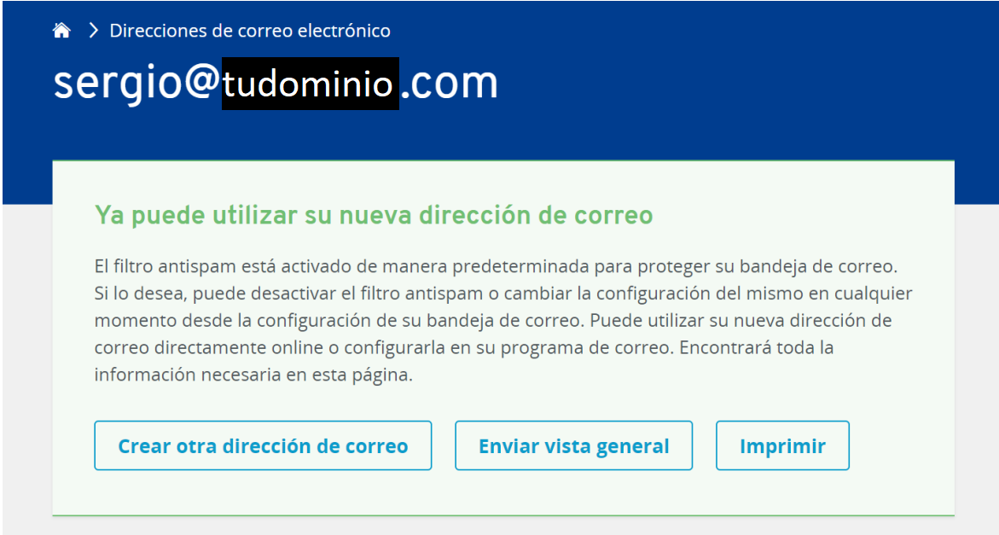

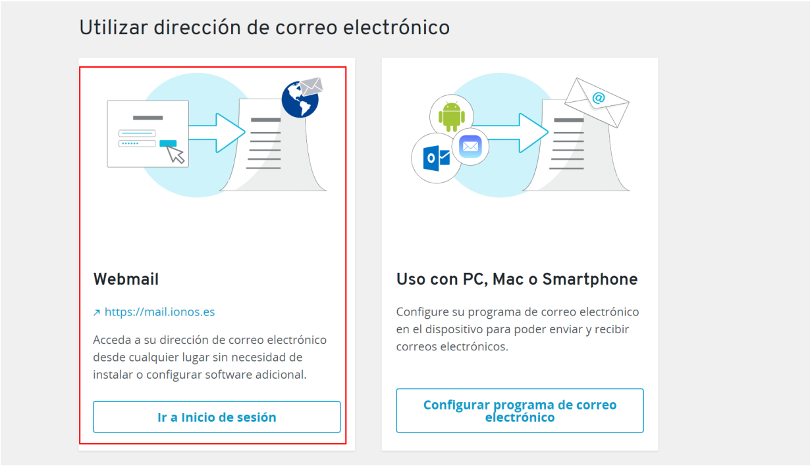

**Nota**: Este botón te llevará al "login" a través de la URL: https://mail.ionos.es/

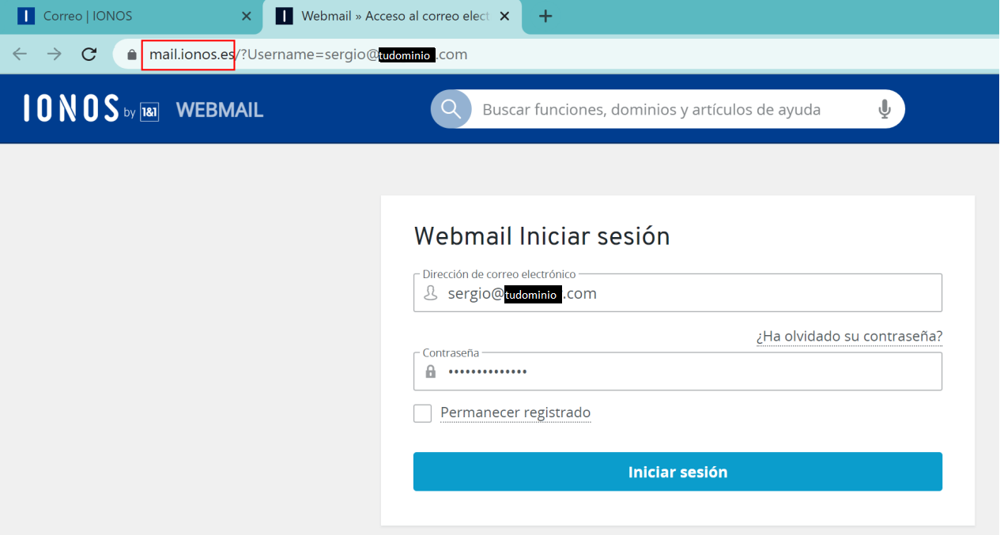

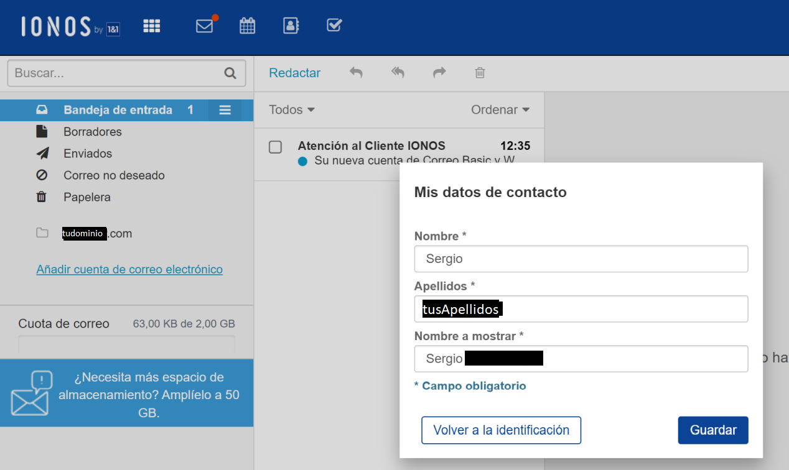

### Comprobación final - prueba de email

Nos enviamos un email a nuestro correo electrónico personal para ver si todo ha funcionado correctamente.

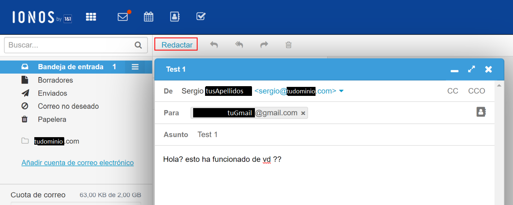

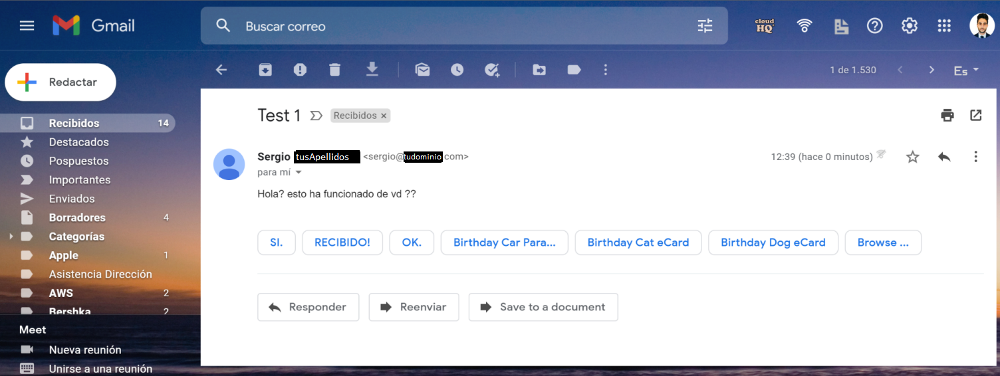

Una vez recibido, en Gmail, en las opciones del mensaje, pulsamos en *"Mostrar Original"*...

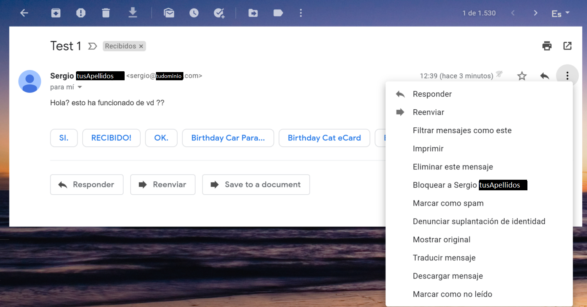

... y buscamos la siguiente sentencia del "log":

`spf=pass (google.com: domain of sergio@tudominio.com designates 212.227.17.10 as permitted sender)`

Si hemos encontrado esta sentencia, significa que todo ha funcionado todo correctamente.

## Resources

### Definir el registro SPF: configuración avanzada

https://support.google.com/a/answer/10683907?hl=es

### Cómo Microsoft 365 usa el marco de directivas de remitente (SPF) para evitar la suplantación de identidad

https://docs.microsoft.com/es-es/microsoft-365/security/office-365-security/how-office-365-uses-spf-to-prevent-spoofing?view=o365-worldwide

# 4. Pasos siguientes: DKIM y DMARC

SPF está diseñado para ayudar a evitar la suplantación de identidad, pero existen técnicas de suplantación de identidad contra las que SPF no puede protegerlo. Para defenderse de estos, una vez que haya configurado SPF, debe configurar **DKIM y DMARC**.

El objetivo de la autenticación de correo electrónico **DKIM** es **demostrar que el contenido del correo no haya sido manipulado**, añadiendo una firma digital a todos los mensajes enviados, lo que **permite** a los servidores que los reciben **verificar que realmente proceden de tu organización**.

El objetivo de la autenticación de correo electrónico **DMARC** es **asegurarse de que la información de SPF y DKIM coincida con la dirección De**, de modo que **permite** indicar a los servidores que reciben tu correo **qué** deben **hacer con los mensajes que se envían desde tu organización y que no superan las comprobaciones de SPF o DKIM**.

## 4.1. Evitar el spoofing y el spam con SPF

https://support.google.com/a/answer/33786?hl=es-419

## 4.2. Evitar el spoofing y el spam con DKIM

https://support.google.com/a/answer/174124?hl=es-419

## 4.3. Evitar el spoofing y el spam con DMARC

https://support.google.com/a/answer/2466580?hl=es

# 5. Prueba final - Ejemplo práctico - Pregunta Teoría

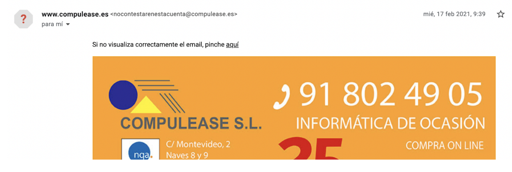

## ¿Por qué Google pone el interrogante rojo?

En las opciones del mensaje, la opción de *"Mostrar Original"* nos muestra lo siguiente:

Delivered-To: profesor@altair.edu.es

Received: by 2002:ac9:26e5:0:0:0:0:0 with SMTP id 92csp2653913ocx; Wed, 17 Feb 2021 00:39:45 -0800 (PST)

X-Google-Smtp-Source: ABdhPJxJI +rzNWSR218wOxjNm8Gb92MYyuIROP3B9gkRlCCSVYQNzNfAlzExqQK4eb6t7W pSe49

X-Received: by 2002:adf:f6c3:: with SMTP id y3mr28023076wrp.24.1613551185353; Wed, 17 Feb 2021 00:39:45 -0800 (PST)

ARC-Seal: i=1; a=rsa-sha256; t=1613551185; cv=none; d=google.com; s=arc-20160816; b=Sb8c0m0yN/Gs3b18ShohBl8Aal+4P6yG4jc9nhuT+Jv0Lm6G6eUb +oMKxK6E3uPYb KlWnX5zXLjzUkdiiuL5Q6J+HF1DajP1dxMZL0omneJKW scI9JsX5PGDuzykqRDf72K9 Sv/AB9CD7x2P8hbPWDM33tDAXKU2dggiGcLQEwMQYn/ue38 sIo1RdwF1YSiXc2WYcF2 zZqtLHPW7xK5selIvoPWDvWgiLDugV/d HUD0GCusRBHomjrcAnCRGX655WT2309mnPX zpK6QtLP1R0UzTIlWp6ypoKgBn0kg6PttLB0j90DZC0of+Mj3k1e4nWeBcfLMcEZz5CS jRFg==

ARC-Message-Signature: i=1; a=rsa-sha256; c=relaxed/relaxed; d=google.com; s=arc-20160816; h=mime-version:subject:to:reply-to:from:date:message-id; bh=3vryqfB25bCwmBWsNzyISzn0Uvinn+SM6FS84LuDxUk=; b=X +6acxMlo1JgEUi96pbl5WoZdiFYbmC88zMrJ+DwHchq5JRMXEtx/bgVNQPDvho3N 7yDc5ueZOLzAHuqXK4CoiYucsk1eMDEvZYqpWC7fBLJfNDGVa+PXVRvVp1vjGcNWCaho 60ywd2XYGbDrNxOk0okdrHfDss+99ZXSi6krfK16rTsbg23InhphFhqXeAe0kOzXgxMY v2j +qHb2nJSHykEeTlhaElfBHZlANAkkVVCDMMaZTDXPEP5AnJOY96kYeIBVvZPzNGr OptP2ghE8llVnuF8bu5BED0mOrVxoRQioV7DjWGS2TknZQ3ytlvCGm2qqmw7nAQ1l3hJ K7XA==

ARC-Authentication-Results: i=1; mx.google.com; soft-fail (google.com: domain of transitioning nocontestarenestacuenta@compulease.es does not designate 178.33.117.241 as permitted sender)

smtp.mailfrom=nocontestarenestacuenta@compulease.es

Return-Path: <nocontestarenestacuenta@compulease.es>

Received: from mail1.nmailing.com (mail2.nmailing.com. [178.33.117.241]) by mx.google.com with ESMTPS id p1si1211028wra.138.2021.02.17.00.39.45 for <profesor@altair.edu.es> (version=TLS1 cipher=AES128-SHA bits=128/128); Wed, 17 Feb 2021 00:39:45 -0800 (PST)

Received-SPF: softfail (google.com: domain of transitioning nocontestarenestacuenta@compulease.es does not designate 178.33.117.241 as permitted sender) client-ip=178.33.117.241;

Authentication-Results: mx.google.com; spf=softfail (google.com: domain of transitioning nocontestarenestacuenta@compulease.es does not designate 178.33 117.241 as permitted sender) smtp.mailfrom=nocontestarenestacuenta@compulease.es

Received: (qmail 19649 invoked from network); 17 Feb 2021 08:39:44
-0000

Received: from unknown (HELO gamma2.nroot.es) ([148.251.236.73]) (envelope-sender <nocontestarenestacuenta@compulease.es>) by mail2.nmailing com (qmail-ldap-1.03) with SMTP for <profesor@altair.edu.es>; 17 Feb 2021 08:39:44 -0000 Message-ID: <1151428463.1613551186666.JavaMail.root@gamma2.nroot.es>

Date: Wed, 17 Feb 2021 09:39:46 +0100 (CET)

From: "www.compulease.es" <nocontestarenestacuenta@compulease.es>

Reply-To: info@compulease.es

To: profesor@altair.edu.es

Subject: informática de ocasión de calidad superior para la Empresa y el profesional

MIME-Version: 1.0

Content-Type: multipart/related; boundary="----=_Part_245_748308185.161 3551186613"

## Respuesta

Si en las opciones del mensaje pulsamos la opción de "mostrar original" podremos ver los detalles de por qué la interrogación en rojo.

Podemos encontrar la siguiente sentencia:

**soft-fail** (google.com: domain of transitioning **nocontestarenestacuenta@compulease.es does not designate 178.33.117.241 as permitted sender**)

En la cual, **spf nos da el resultado de la autenticación fallida (SoftFail)**.

Podemos encontrar el SoftFail y el HardFail.

En este caso (SoftFail), viene dado por los mecanismos con unos valores concretos, en el registro DNS tipo SPF:

- include:_spf.perfora.net
- include:_spf.kundenserver.de
- ~all

Este SoftFail viene dado tanto por esos dos includes (los cuales recomienda IONOS), y por la regla de obligatorio cumplimiento (enforcement rule) ~all, a la cual tiene el calificador de la virgulilla, lo que significa que "supera la autenticación con reservas",

u en otras palabras, que hemos podido recibir ese falso email, pero automáticamente nuestro servidor de correo (gmail en este caso), lo ha marcado directamente como spam sospechoso.

Received-SPF: softfail (google.com: domain of transitioning nocontestarenestacuenta@compulease.es does not designate 178.33.117.241 as permitted sender) client-ip=178.33.117.241;

incluso en esta segunda sentencia que encontramos en la información del mensaje original, **Google nos avisa de que la dirección IP_client del mensaje, no coincide con ninguna especificada en ningún valor del registro SPF de compulease.es, donde se indican los servidores autorizados y permitidos. con lo que, el remitente de este sospechoso mensaje, no es el propietario del dominio que parece que lo ha enviado**.

## GNU Free Documentation License

Copyright (C)  2022  Sergio Díaz Campos.
    Permission is granted to copy, distribute and/or modify this document
    under the terms of the GNU Free Documentation License, Version 1.3
    or any later version published by the Free Software Foundation;
    with no Invariant Sections, no Front-Cover Texts, and no Back-Cover Texts.
    A copy of the license is included in the section entitled "GNU
    Free Documentation License".
